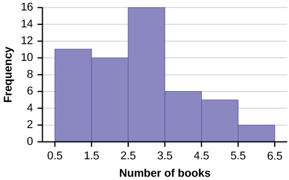
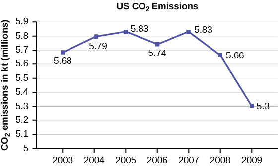
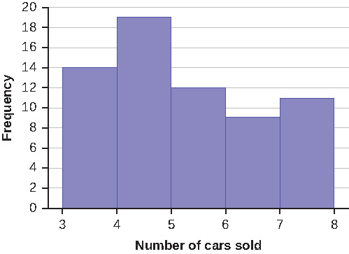
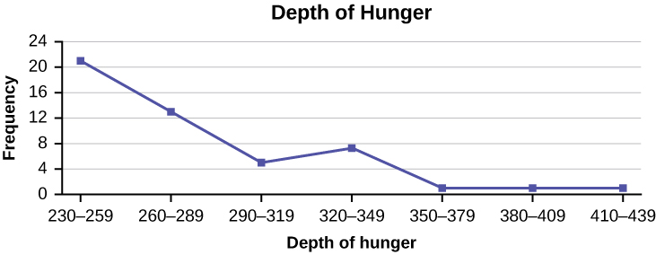
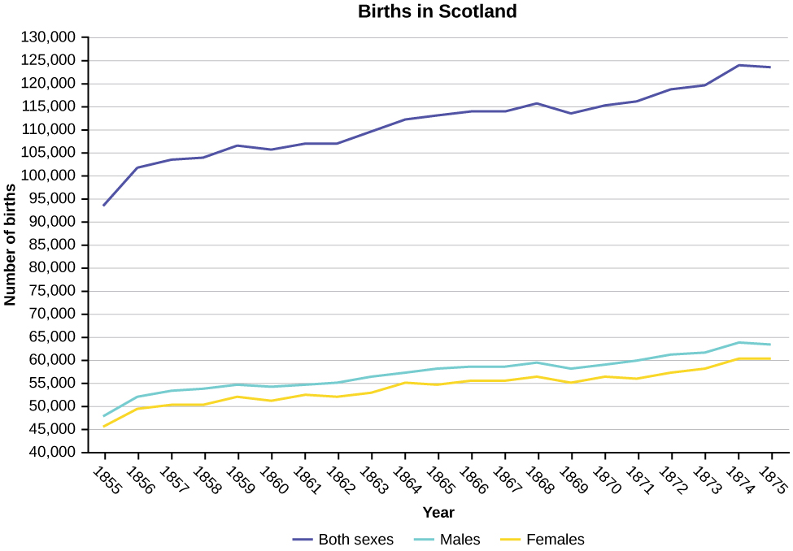
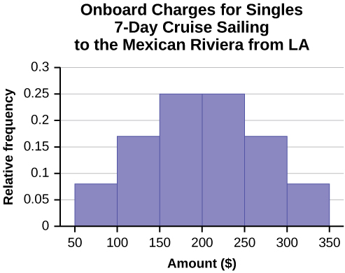
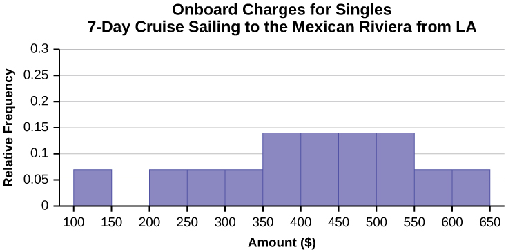
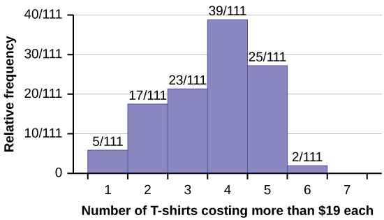

For most of the work you do in this book, you will use a histogram to display the data. One advantage of a histogram is that it can readily display large data sets. A rule of thumb is to use a histogram when the data set consists of 100 values or more.

A **histogram**{: data-type="term"} consists of contiguous (adjoining) boxes. It has both a horizontal axis and a vertical axis. The horizontal axis is labeled with what the data represents (for instance, distance from your home to school). The vertical axis is labeled either **frequency**{: data-type="term"} or **relative frequency**{: data-type="term"} (or percent frequency or probability). The graph will have the same shape with either label. The histogram (like the stemplot) can give you the shape of the data, the center, and the spread of the data.

The relative frequency is equal to the frequency for an observed value of the data divided by the total number of data values in the sample.(Remember, frequency is defined as the number of times an answer occurs.) If:

* *f* = frequency
* *n* = total number of data values (or the sum of the individual frequencies), and
* *RF* = relative frequency,

then: 

<math xmlns="http://www.w3.org/1998/Math/MathML"> <semantics> <mrow> <mstyle fontsize="12pt"> <mrow> <mrow> <mstyle fontstyle="italic"> <mrow> <mtext>RF</mtext> </mrow> </mstyle> <mo stretchy="false">=</mo> <mfrac> <mstyle fontsize="8pt"> <mrow> <mi>f</mi> </mrow> </mstyle> <mstyle fontsize="8pt"> <mrow> <mi>n</mi> </mrow> </mstyle> </mfrac> </mrow> </mrow> </mstyle> <mrow /> </mrow> </semantics> </math>

For example, if three students in Mr. Ahab\'s English class of 40 students received from 90% to 100%, then, <!--<newline count="1"/>-->*f* = 3, *n* = 40, and *RF* = <math xmlns="http://www.w3.org/1998/Math/MathML"> <mrow><mfrac><mi>f</mi><mi>n</mi></mfrac></mrow></math>

 = <math xmlns="http://www.w3.org/1998/Math/MathML"><mrow><mfrac><mn>3</mn><mrow><mn>40</mn></mrow></mfrac></mrow></math>

 = 0.075. 7.5% of the students received 90–100%. 90–100% are quantitative measures.

**To construct a histogram**, first decide how many **bars** or **intervals**, also called classes, represent the data. Many histograms consist of five to 15 bars or classes for clarity. The number of bars needs to be chosen. Choose a starting point for the first interval to be less than the smallest data value. A **convenient starting point** is a lower value carried out to one more decimal place than the value with the most decimal places. For example, if the value with the most decimal places is 6.1 and this is the smallest value, a convenient starting point is 6.05 (6.1 – 0.05 = 6.05). We say that 6.05 has more precision. If the value with the most decimal places is 2.23 and the lowest value is 1.5, a convenient starting point is 1.495 (1.5 – 0.005 = 1.495). If the value with the most decimal places is 3.234 and the lowest value is 1.0, a convenient starting point is 0.9995 (1.0 – 0.0005 = 0.9995). If all the data happen to be integers and the smallest value is two, then a convenient starting point is 1.5 (2 – 0.5 = 1.5). Also, when the starting point and other boundaries are carried to one additional decimal place, no data value will fall on a boundary. The next two examples go into detail about how to construct a histogram using continuous data and how to create a histogram using discrete data.

The following data are the heights (in inches to the nearest half inch) of 100 male semiprofessional soccer players. The heights are **continuous** data, since height is measured. * * *
{: data-type="newline"}

60; 60.5; 61; 61; 61.5 * * *
{: data-type="newline"}

63.5; 63.5; 63.5 * * *
{: data-type="newline"}

64; 64; 64; 64; 64; 64; 64; 64.5; 64.5; 64.5; 64.5; 64.5; 64.5; 64.5; 64.5 * * *
{: data-type="newline"}

66; 66; 66; 66; 66; 66; 66; 66; 66; 66; 66.5; 66.5; 66.5; 66.5; 66.5; 66.5; 66.5; 66.5; 66.5; 66.5; 66.5; 67; 67; 67; 67; 67; 67; 67; 67; 67; 67; 67; 67; 67.5; 67.5; 67.5; 67.5; 67.5; 67.5; 67.5 * * *
{: data-type="newline"}

68; 68; 69; 69; 69; 69; 69; 69; 69; 69; 69; 69; 69.5; 69.5; 69.5; 69.5; 69.5 * * *
{: data-type="newline"}

70; 70; 70; 70; 70; 70; 70.5; 70.5; 70.5; 71; 71; 71 * * *
{: data-type="newline"}

72; 72; 72; 72.5; 72.5; 73; 73.5 * * *
{: data-type="newline"}

74

The smallest data value is 60. Since the data with the most decimal places has one decimal (for instance, 61.5), we want our starting point to have two decimal places. Since the numbers 0.5, 0.05, 0.005, etc. are convenient numbers, use 0.05 and subtract it from 60, the smallest value, for the convenient starting point.

60 – 0.05 = 59.95 which is more precise than, say, 61.5 by one decimal place. The starting point is, then, 59.95.

The largest value is 74, so 74 + 0.05 = 74.05 is the ending value.

Next, calculate the width of each bar or class interval. To calculate this width, subtract the starting point from the ending value and divide by the number of bars (you must choose the number of bars you desire). Suppose you choose eight bars.

<math xmlns="http://www.w3.org/1998/Math/MathML"> <apply> <eq /> <apply> <divide /> <apply> <minus /> <cn>74.05</cn> <cn>59.95</cn> </apply> <cn>8</cn> </apply> <cn>1.76</cn> </apply> </math>

NOTE

We will round up to two and make each bar or class interval two units wide. Rounding up to two is one way to prevent a value from falling on a boundary. Rounding to the next number is often necessary even if it goes against the standard rules of rounding. For this example, using 1.76 as the width would also work. A guideline that is followed by some for the width of a bar or class interval is to take the square root of the number of data values and then round to the nearest whole number, if necessary. For example, if there are 150 values of data, take the square root of 150 and round to 12 bars or intervals.

The boundaries are:

* 59\.95
* 59\.95 + 2 = 61.95
* 61\.95 + 2 = 63.95
* 63\.95 + 2 = 65.95
* 65\.95 + 2 = 67.95
* 67\.95 + 2 = 69.95
* 69\.95 + 2 = 71.95
* 71\.95 + 2 = 73.95
* 73\.95 + 2 = 75.95

The heights 60 through 61.5 inches are in the interval 59.95–61.95. The heights that are 63.5 are in the interval 61.95–63.95. The heights that are 64 through 64.5 are in the interval 63.95–65.95. The heights 66 through 67.5 are in the interval 65.95–67.95. The heights 68 through 69.5 are in the interval 67.95–69.95. The heights 70 through 71 are in the interval 69.95–71.95. The heights 72 through 73.5 are in the interval 71.95–73.95. The height 74 is in the interval 73.95–75.95.

The following histogram displays the heights on the *x*-axis and relative frequency on the *y*-axis.

{: #eip-idm88475792}

Try It

The following data are the shoe sizes of 50 male students. The sizes are continuous data since shoe size is measured. Construct a histogram and calculate the width of each bar or class interval. Suppose you choose six bars. * * *
{: data-type="newline"}

9; 9; 9.5; 9.5; 10; 10; 10; 10; 10; 10; 10.5; 10.5; 10.5; 10.5; 10.5; 10.5; 10.5; 10.5 * * *
{: data-type="newline"}

11; 11; 11; 11; 11; 11; 11; 11; 11; 11; 11; 11; 11; 11.5; 11.5; 11.5; 11.5; 11.5; 11.5; 11.5 * * *
{: data-type="newline"}

12; 12; 12; 12; 12; 12; 12; 12.5; 12.5; 12.5; 12.5; 14

Smallest value: 9

Largest value: 14

Convenient starting value: 9 – 0.05 = 8.95

Convenient ending value: 14 + 0.05 = 14.05

<math xmlns="http://www.w3.org/1998/Math/MathML"> <mrow> <mfrac> <mrow> <mn>14.05</mn><mo>−</mo><mn>8.95</mn> </mrow> <mn>6</mn> </mfrac> <mo>=</mo><mn>0.85</mn> </mrow> </math>

The calculations suggests using 0.85 as the width of each bar or class interval. You can also use an interval with a width equal to one.

The following data are the number of books bought by 50 part-time college students at ABC College. The number of books is **discrete data**, since books are counted. * * *
{: data-type="newline"}

1; 1; 1; 1; 1; 1; 1; 1; 1; 1; 1 * * *
{: data-type="newline"}

2; 2; 2; 2; 2; 2; 2; 2; 2; 2 * * *
{: data-type="newline"}

3; 3; 3; 3; 3; 3; 3; 3; 3; 3; 3; 3; 3; 3; 3; 3 * * *
{: data-type="newline"}

4; 4; 4; 4; 4; 4 * * *
{: data-type="newline"}

5; 5; 5; 5; 5 * * *
{: data-type="newline"}

6; 6

Eleven students buy one book. Ten students buy two books. Sixteen students buy three books. Six students buy four books. Five students buy five books. Two students buy six books.

Because the data are integers, subtract 0.5 from 1, the smallest data value and add 0.5 to 6, the largest data value. Then the starting point is 0.5 and the ending value is 6.5.

Next, calculate the width of each bar or class interval. If the data are discrete and there are not too many different values, a width that places the data values in the middle of the bar or class interval is the most convenient. Since the data consist of the numbers 1, 2, 3, 4, 5, 6, and the starting point is 0.5, a width of one places the 1 in the middle of the interval from 0.5 to 1.5, the 2 in the middle of the interval from 1.5 to 2.5, the 3 in the middle of the interval from 2.5 to 3.5, the 4 in the middle of the interval from \_\_\_\_\_\_\_ to \_\_\_\_\_\_\_, the 5 in the middle of the interval from \_\_\_\_\_\_\_ to \_\_\_\_\_\_\_, and the \_\_\_\_\_\_\_ in the middle of the interval from \_\_\_\_\_\_\_ to \_\_\_\_\_\_\_ .

* 3\.5 to 4.5
* 4\.5 to 5.5
* 6
* 5\.5 to 6.5

Calculate the number of bars as follows:

<math xmlns="http://www.w3.org/1998/Math/MathML"> <apply> <eq /> <apply> <divide /> <apply> <minus /> <cn>6.5</cn> <cn>0.5</cn> </apply> <ci>number of bars</ci> </apply> <cn>1</cn> </apply> </math>

where 1 is the width of a bar. Therefore, bars = 6.

The following histogram displays the number of books on the *x*-axis and the frequency on the *y*-axis.

{: #eip-idp35221648}

Go to [\[link\]](/m47896). There are calculator instructions for entering data and for creating a customized histogram. Create the histogram for [\[link\]](#exampid2).

* Press Y=. Press CLEAR to delete any equations.
* Press STAT 1:EDIT. If L1 has data in it, arrow up into the name L1, press CLEAR and then arrow down. If necessary, do the same for L2.
* Into L1, enter 1, 2, 3, 4, 5, 6.
* Into L2, enter 11, 10, 16, 6, 5, 2.
* Press WINDOW. Set Xmin = .5, Xscl = (6.5 – .5)/6, Ymin = –1, Ymax = 20, Yscl = 1, Xres = 1.
* Press 2nd Y=. Start by pressing 4:Plotsoff ENTER.
* Press 2nd Y=. Press 1:Plot1. Press ENTER. Arrow down to TYPE. Arrow to the 3rd picture (histogram). Press ENTER.
* Arrow down to Xlist: Enter L1 (2nd 1). Arrow down to Freq. Enter L2 (2nd 2).
* Press GRAPH.
* Use the TRACE key and the arrow keys to examine the histogram.

Try It

The following data are the number of sports played by 50 student athletes. The number of sports is discrete data since sports are counted.

1; 1; 1; 1; 1; 1; 1; 1; 1; 1; 1; 1; 1; 1; 1; 1; 1; 1; 1; 1 * * *
{: data-type="newline"}

2; 2; 2; 2; 2; 2; 2; 2; 2; 2; 2; 2; 2; 2; 2; 2; 2; 2; 2; 2; 2; 2 * * *
{: data-type="newline"}

3; 3; 3; 3; 3; 3; 3; 3 * * *
{: data-type="newline"}

20 student athletes play one sport. 22 student athletes play two sports. Eight student athletes play three sports.

*Fill in the blanks for the following sentence.* Since the data consist of the numbers 1, 2, 3, and the starting point is 0.5, a width of one places the 1 in the middle of the interval 0.5 to \_\_\_\_\_, the 2 in the middle of the interval from \_\_\_\_\_ to \_\_\_\_\_, and the 3 in the middle of the interval from \_\_\_\_\_ to \_\_\_\_\_.

1\.5 * * *
{: data-type="newline"}

1.5 to 2.5 * * *
{: data-type="newline"}

2.5 to 3.5

Using this data set, construct a histogram.

<table summary=""><thead>
<tr>
<th colspan="5">Number of Hours My Classmates Spent Playing Video Games on Weekends</th>
</tr>
</thead><tbody>
<tr>
<td>9.95</td>
<td>10</td>
<td>2.25</td>
<td>16.75</td>
<td>0</td>
</tr>
<tr>
<td>19.5</td>
<td>22.5</td>
<td>7.5</td>
<td>15</td>
<td>12.75</td>
</tr>
<tr>
<td>5.5</td>
<td>11</td>
<td>10</td>
<td>20.75</td>
<td>17.5</td>
</tr>
<tr>
<td>23</td>
<td>21.9</td>
<td>24</td>
<td>23.75</td>
<td>18</td>
</tr>
<tr>
<td>20</td>
<td>15</td>
<td>22.9</td>
<td>18.8</td>
<td>20.5</td>
</tr>
</tbody></table>

{:}

Some values in this data set fall on boundaries for the class intervals. A value is counted in a class interval if it falls on the left boundary, but not if it falls on the right boundary. Different researchers may set up histograms for the same data in different ways. There is more than one correct way to set up a histogram.

Try It

The following data represent the number of employees at various restaurants in New York City. Using this data, create a histogram.

 22351526 40281820 25343942 24221927 22344020 38and 28  * * *
{: data-type="newline"}

Use 10–19 as the first interval.

Count the money (bills and change) in your pocket or purse. Your instructor will record the amounts. As a class, construct a histogram displaying the data. Discuss how many intervals you think is appropriate. You may want to experiment with the number of intervals.

# Frequency Polygons

Frequency polygons are analogous to line graphs, and just as line graphs make continuous data visually easy to interpret, so too do frequency polygons.

To construct a frequency polygon, first examine the data and decide on the number of intervals, or class intervals, to use on the *x*-axis and *y*-axis. After choosing the appropriate ranges, begin plotting the data points. After all the points are plotted, draw line segments to connect them.

A frequency polygon was constructed from the frequency table below.

<table summary=""><thead>
<tr><th colspan="4">Frequency Distribution for Calculus Final Test Scores</th></tr>
<tr><th>Lower Bound</th><th>Upper Bound</th>	<th>Frequency</th><th>Cumulative Frequency</th></tr>
</thead><tbody>
<tr>
<td>49.5</td>
<td>59.5</td><td>5</td><td>5</td>
</tr>
<tr><td>59.5</td><td>69.5</td><td>10</td><td>15</td></tr><tr><td>69.5</td><td>79.5</td>	<td>30</td><td>45</td></tr><tr><td>79.5</td><td>89.5</td><td>40</td><td>85</td></tr>
<tr><td>89.5</td><td>99.5</td><td>15</td><td>100</td></tr>
</tbody></table>
{: #eip-idm19499056}

The first label on the *x*-axis is 44.5. This represents an interval extending from 39.5 to 49.5. Since the lowest test score is 54.5, this interval is used only to allow the graph to touch the *x*-axis. The point labeled 54.5 represents the next interval, or the first “real” interval from the table, and contains five scores. This reasoning is followed for each of the remaining intervals with the point 104.5 representing the interval from 99.5 to 109.5. Again, this interval contains no data and is only used so that the graph will touch the *x*-axis. Looking at the graph, we say that this distribution is skewed because one side of the graph does not mirror the other side.

Try It

Construct a frequency polygon of U.S. Presidents’ ages at inauguration shown in [[link]](#fs-idp36852784).

| Age at Inauguration | Frequency |
|----------
| 41.5–46.5 | 4 |
| 46.5–51.5 | 11 |
| 51.5–56.5 | 14 |
| 56.5–61.5 | 9 |
| 61.5–66.5 | 4 |
| 66.5–71.5 | 2 |
{: summary=""}

The first label on the *x*-axis is 39. This represents an interval extending from 36.5 to 41.5. Since there are no ages less than 41.5, this interval is used only to allow the graph to touch the *x*-axis. The point labeled 44 represents the next interval, or the first “real” interval from the table, and contains four scores. This reasoning is followed for each of the remaining intervals with the point 74 representing the interval from 71.5 to 76.5. Again, this interval contains no data and is only used so that the graph will touch the *x*-axis. Looking at the graph, we say that this distribution is skewed because one side of the graph does not mirror the other side.

{: #eip-idp57000416}

Frequency polygons are useful for comparing distributions. This is achieved by overlaying the frequency polygons drawn for different data sets.

We will construct an overlay frequency polygon comparing the scores from [\[link\]](#example4) with the students’ final numeric grade.

<table summary=""><thead>
<tr><th colspan="4">Frequency Distribution for Calculus Final Test Scores</th></tr>
<tr><th>Lower Bound</th><th>Upper Bound</th>	<th>Frequency</th><th>Cumulative Frequency</th></tr>
</thead><tbody>
<tr><td>49.5</td><td>59.5</td><td>5</td>	<td>5</td></tr>
<tr><td>59.5</td><td>69.5</td><td>10</td>	<td>15</td></tr>
<tr><td>69.5</td><td>79.5</td><td>30</td>	<td>45</td></tr>
<tr><td>79.5</td><td>89.5</td><td>40</td>	<td>85</td></tr>
<tr><td>89.5</td><td>99.5</td><td>15</td>	<td>100</td></tr>
</tbody></table>
<table summary=""><thead>
<tr><th colspan="4">Frequency Distribution for Calculus Final Grades</th></tr>
<tr><th>Lower Bound</th>	<th>Upper Bound</th>	<th>Frequency</th><th>Cumulative Frequency</th></tr>
</thead><tbody>
<tr><td>49.5</td><td>59.5</td><td>10</td>	<td>10</td></tr>
<tr><td>59.5</td><td>69.5</td><td>10</td>	<td>20</td></tr>
<tr><td>69.5</td><td>79.5</td><td>30</td>	<td>50</td></tr>
<tr><td>79.5</td><td>89.5</td><td>45</td>	<td>95</td></tr>
<tr><td>89.5</td><td>99.5</td><td>5</td>	<td>100</td></tr>
</tbody></table>
{: #eip-id1165746871888}

Suppose that we want to study the temperature range of a region for an entire month. Every day at noon we note the temperature and write this down in a log. A variety of statistical studies could be done with this data. We could find the mean or the median temperature for the month. We could construct a histogram displaying the number of days that temperatures reach a certain range of values. However, all of these methods ignore a portion of the data that we have collected.

One feature of the data that we may want to consider is that of time. Since each date is paired with the temperature reading for the day, we don‘t have to think of the data as being random. We can instead use the times given to impose a chronological order on the data. A graph that recognizes this ordering and displays the changing temperature as the month progresses is called a time series graph.

# Constructing a Time Series Graph

To construct a time series graph, we must look at both pieces of our **paired data set**{: data-type="term"}. We start with a standard Cartesian coordinate system. The horizontal axis is used to plot the date or time increments, and the vertical axis is used to plot the values of the variable that we are measuring. By doing this, we make each point on the graph correspond to a date and a measured quantity. The points on the graph are typically connected by straight lines in the order in which they occur.

The following data shows the Annual Consumer Price Index, each month, for ten years. Construct a time series graph for the Annual Consumer Price Index data only.

<table summary=""><colgroup><col data-align="center" /><col /><col /><col /><col /><col /><col /><col /></colgroup><thead>
<tr valign="middle">
<th>Year</th><th>Jan</th><th>Feb</th><th>Mar</th><th>Apr</th><th>May</th><th>Jun</th><th>Jul</th>
</tr>
</thead><tbody>
<tr>
<td><strong>2003</strong></td>
<td>181.7</td><td>183.1</td><td>184.2</td><td>183.8</td>
<td>183.5</td><td>183.7</td><td>183.9</td>
</tr>
<tr>
<td><strong>2004</strong></td>
<td>185.2</td><td>186.2</td><td>187.4</td><td>188.0</td>
<td>189.1</td><td>189.7</td><td>189.4</td>
</tr>
<tr>
<td><strong>2005</strong></td>
<td>190.7</td><td>191.8</td><td>193.3</td><td>194.6</td>
<td>194.4</td><td>194.5</td><td>195.4</td>
</tr>
<tr>
<td><strong>2006</strong></td>
<td>198.3</td><td>198.7</td><td>199.8</td><td>201.5</td>	<td>202.5</td><td>202.9</td><td>203.5</td></tr>
<tr>
<td><strong>2007</strong></td>
<td>202.416</td><td>203.499</td><td>205.352</td>
<td>206.686</td><td>207.949</td><td>208.352</td>
<td>208.299</td>
</tr>
<tr>
<td><strong>2008</strong></td>
<td>211.080</td><td>211.693</td><td>213.528</td>
<td>214.823</td><td>216.632</td><td>218.815</td>
<td>219.964</td>
</tr>
<tr>
<td><strong>2009</strong></td>
<td>211.143</td><td>212.193</td><td>212.709</td>
<td>213.240</td><td>213.856</td><td>215.693</td>
<td>215.351</td></tr>
<tr>
<td><strong>2010</strong></td>
<td>216.687</td><td>216.741</td><td>217.631</td>
<td>218.009</td><td>218.178</td><td>217.965</td>
<td>218.011</td>
</tr>
<tr>
<td><strong>2011</strong></td>
<td>220.223</td><td>221.309</td><td>223.467</td>
<td>224.906</td><td>225.964</td><td>225.722</td>
<td>225.922</td>
</tr>
<tr>
<td><strong>2012</strong></td>
<td>226.665</td><td>227.663</td><td>229.392</td>
<td>230.085</td><td>229.815</td><td>229.478</td>
<td>229.104</td></tr>
</tbody></table>
<table summary=""><colgroup><col data-align="center" /><col /><col /><col /><col /><col /><col /><col /></colgroup><thead>
<tr>
<th>Year</th>
<th>Aug</th><th>Sep</th><th>Oct</th><th>Nov</th><th>Dec</th><th>Annual</th>
</tr>
</thead><tbody>
<tr>
<td><strong>2003</strong></td>
<td>184.6</td>
<td>185.2</td><td>185.0</td><td>184.5</td><td>184.3</td>
<td>184.0</td>
</tr>
<tr>
<td><strong>2004</strong></td>
<td>189.5</td>
<td>189.9</td><td>190.9</td><td>191.0</td><td>190.3</td>
<td>188.9</td>
</tr>
<tr>
<td><strong>2005</strong></td>
<td>196.4</td>
<td>198.8</td><td>199.2</td><td>197.6</td><td>196.8</td>
<td>195.3</td>
</tr>
<tr>
<td><strong>2006</strong></td>
<td>203.9</td>	<td>202.9</td><td>201.8</td><td>201.5</td><td>201.8</td>	<td>201.6</td>
</tr>
<tr>
<td><strong>2007</strong></td>
<td>207.917</td><td>208.490</td>
<td>208.936</td><td>210.177</td><td>210.036</td>
<td>207.342</td>
</tr>
<tr>
<td><strong>2008</strong></td>
<td>219.086</td><td>218.783</td>
<td>216.573</td><td>212.425</td><td>210.228</td>
<td>215.303</td>
</tr>
<tr>
<td><strong>2009</strong></td>
<td>215.834</td><td>215.969</td>
<td>216.177</td><td>216.330</td><td>215.949</td>
<td>214.537</td>
</tr>
<tr>
<td><strong>2010</strong></td>
<td>218.312</td><td>218.439</td>
<td>218.711</td><td>218.803</td><td>219.179</td>
<td>218.056</td>
</tr>
<tr>
<td><strong>2011</strong></td>
<td>226.545</td><td>226.889</td>
<td>226.421</td><td>226.230</td><td>225.672</td>
<td>224.939</td>
</tr>
<tr>
<td><strong>2012</strong></td>
<td>230.379</td><td>231.407</td>
<td>231.317</td><td>230.221</td><td>229.601</td>
<td>229.594</td>
</tr>
</tbody></table>

{: #eip-idm68714544}

Try It

The following table is a portion of a data set from www.worldbank.org. Use the table to construct a time series graph for CO2 emissions for the United States.

<table summary=""><thead>
<tr>
<th colspan="4">CO2 Emissions</th>
</tr>
<tr>
<th />
<th>Ukraine</th>
<th>United Kingdom</th>
<th>United States</th>
</tr>
</thead><tbody>
<tr>
<td>2003</td>
<td>352,259</td>
<td>540,640</td>
<td>5,681,664</td>
</tr>
<tr>
<td>2004</td>
<td>343,121</td>
<td>540,409</td>
<td>5,790,761</td>
</tr>
<tr>
<td>2005</td>
<td>339,029</td>
<td>541,990</td>
<td>5,826,394</td>
</tr>
<tr>
<td>2006</td>
<td>327,797</td>
<td>542,045</td>
<td>5,737,615</td>
</tr>
<tr>
<td>2007</td>
<td>328,357</td>
<td>528,631</td>
<td>5,828,697</td>
</tr>
<tr>
<td>2008</td>
<td>323,657</td>
<td>522,247</td>
<td>5,656,839</td>
</tr>
<tr>
<td>2009</td>
<td>272,176</td>
<td>474,579</td>
<td>5,299,563</td>
</tr>
</tbody></table>

{: #eip-idp40339472}

## Uses of a Time Series Graph

Time series graphs are important tools in various applications of statistics. When recording values of the same variable over an extended period of time, sometimes it is difficult to discern any trend or pattern. However, once the same data points are displayed graphically, some features jump out. Time series graphs make trends easy to spot.

# References

Data on annual homicides in Detroit, 1961–73, from Gunst &amp; Mason’s book ‘Regression Analysis and its Application’, Marcel Dekker

“Timeline: Guide to the U.S. Presidents: Information on every president’s birthplace, political party, term of office, and more.” Scholastic, 2013. Available online at http://www.scholastic.com/teachers/article/timeline-guide-us-presidents (accessed April 3, 2013).

“Presidents.” Fact Monster. Pearson Education, 2007. Available online at http://www.factmonster.com/ipka/A0194030.html (accessed April 3, 2013).

“Food Security Statistics.” Food and Agriculture Organization of the United Nations. Available online at http://www.fao.org/economic/ess/ess-fs/en/ (accessed April 3, 2013).

“Consumer Price Index.” United States Department of Labor: Bureau of Labor Statistics. Available online at http://data.bls.gov/pdq/SurveyOutputServlet (accessed April 3, 2013).

“CO2 emissions (kt).” The World Bank, 2013. Available online at http://databank.worldbank.org/data/home.aspx (accessed April 3, 2013).

“Births Time Series Data.” General Register Office For Scotland, 2013. Available online at http://www.gro-scotland.gov.uk/statistics/theme/vital-events/births/time-series.html (accessed April 3, 2013).

“Demographics: Children under the age of 5 years underweight.” Indexmundi. Available online at http://www.indexmundi.com/g/r.aspx?t=50&amp;v=2224&amp;aml=en (accessed April 3, 2013).

Gunst, Richard, Robert Mason. *Regression Analysis and Its Application: A Data-Oriented Approach*. CRC Press: 1980.

“Overweight and Obesity: Adult Obesity Facts.” Centers for Disease Control and Prevention. Available online at http://www.cdc.gov/obesity/data/adult.html (accessed September 13, 2013).

# Chapter Review

A **histogram** is a graphic version of a frequency distribution. The graph consists of bars of equal width drawn adjacent to each other. The horizontal scale represents classes of quantitative data values and the vertical scale represents frequencies. The heights of the bars correspond to frequency values. Histograms are typically used for large, continuous, quantitative data sets. A frequency polygon can also be used when graphing large data sets with data points that repeat. The data usually goes on *y*-axis with the frequency being graphed on the *x*-axis. Time series graphs can be helpful when looking at large amounts of data for one variable over a period of time.

<section data-depth="1" class="practice">

Sixty-five randomly selected car salespersons were asked the number of cars they generally sell in one week. Fourteen people answered that they generally sell three cars; nineteen generally sell four cars; twelve generally sell five cars; nine generally sell six cars; eleven generally sell seven cars. Complete the table.

| Data Value (# cars) | Frequency | Relative Frequency | Cumulative Relative Frequency |
|----------
|  |  |  |  |
|  |  |  |  |
|  |  |  |  |
|  |  |  |  |
|  |  |  |  |
{: #table001 summary="Blank table where data can be reported with the first column designated for the data value, or number of cars, the second column for frequency, the third column for relative frequency, and the fourth column for cumulative frequency."}

What does the frequency column in [[link]](#table001) sum to? Why?

65

What does the relative frequency column in [[link]](#table001) sum to? Why?

What is the difference between relative frequency and frequency for each data value in [[link]](#table001)?

The relative frequency shows the *proportion* of data points that have each value. The frequency tells the *number* of data points that have each value.

What is the difference between cumulative relative frequency and relative frequency for each data value?

To construct the histogram for the data in [[link]](#table001), determine appropriate minimum and maximum *x* and *y* values and the scaling. Sketch the histogram. Label the horizontal and vertical axes with words. Include numerical scaling.

{: #eip-idp57691072}

Answers will vary. One possible histogram is shown:

{: #eip-idp746160}

Construct a frequency polygon for the following:

1.  | Pulse Rates for Women | Frequency |
    |----------
    | 60–69 | 12 |
    | 70–79 | 14 |
    | 80–89 | 11 |
    | 90–99 | 1 |
    | 100–109 | 1 |
    | 110–119 | 0 |
    | 120–129 | 1 |
    {: summary=""}

2.  | Actual Speed in a 30 MPH Zone | Frequency |
    |----------
    | 42–45 | 25 |
    | 46–49 | 14 |
    | 50–53 | 7 |
    | 54–57 | 3 |
    | 58–61 | 1 |
    {: summary=""}

3.  | Tar (mg) in Nonfiltered Cigarettes | Frequency |
    |----------
    | 10–13 | 1 |
    | 14–17 | 0 |
    | 18–21 | 15 |
    | 22–25 | 7 |
    | 26–29 | 2 |
    {: summary=""}
{: data-number-style="lower-alpha"}

Construct a frequency polygon from the frequency distribution for the 50 highest ranked countries for depth of hunger.

| Depth of Hunger | Frequency |
|----------
| 230–259 | 21 |
| 260–289 | 13 |
| 290–319 | 5 |
| 320–349 | 7 |
| 350–379 | 1 |
| 380–409 | 1 |
| 410–439 | 1 |
{: summary=""}

Find the midpoint for each class. These will be graphed on the *x*-axis. The frequency values will be graphed on the *y*-axis values.

{: #eip-idp56723312}

Use the two frequency tables to compare the life expectancy of men and women from 20 randomly selected countries. Include an overlayed frequency polygon and discuss the shapes of the distributions, the center, the spread, and any outliers. What can we conclude about the life expectancy of women compared to men?

| Life Expectancy at Birth – Women | Frequency |
|----------
| 49–55 | 3 |
| 56–62 | 3 |
| 63–69 | 1 |
| 70–76 | 3 |
| 77–83 | 8 |
| 84–90 | 2 |
{: summary=""}

| Life Expectancy at Birth – Men | Frequency |
|----------
| 49–55 | 3 |
| 56–62 | 3 |
| 63–69 | 1 |
| 70–76 | 1 |
| 77–83 | 7 |
| 84–90 | 5 |
{: summary=""}

Construct a times series graph for (a) the number of male births, (b) the number of female births, and (c) the total number of births.

| Sex/Year | 1855 | 1856 | 1857 | 1858 | 1859 | 1860 | 1861 |
| Female | 45,545 | 49,582 | 50,257 | 50,324 | 51,915 | 51,220 | 52,403 |
| Male | 47,804 | 52,239 | 53,158 | 53,694 | 54,628 | 54,409 | 54,606 |
| Total | 93,349 | 101,821 | 103,415 | 104,018 | 106,543 | 105,629 | 107,009 |
{: summary=""}

| Sex/Year | 1862 | 1863 | 1864 | 1865 | 1866 | 1867 | 1868 | 1869 |
| Female | 51,812 | 53,115 | 54,959 | 54,850 | 55,307 | 55,527 | 56,292 | 55,033 |
| Male | 55,257 | 56,226 | 57,374 | 58,220 | 58,360 | 58,517 | 59,222 | 58,321 |
| Total | 107,069 | 109,341 | 112,333 | 113,070 | 113,667 | 114,044 | 115,514 | 113,354 |
{: summary=""}

| Sex/Year | 1871 | 1870 | 1872 | 1871 | 1872 | 1827 | 1874 | 1875 |
| Female | 56,099 | 56,431 | 57,472 | 56,099 | 57,472 | 58,233 | 60,109 | 60,146 |
| Male | 60,029 | 58,959 | 61,293 | 60,029 | 61,293 | 61,467 | 63,602 | 63,432 |
| Total | 116,128 | 115,390 | 118,765 | 116,128 | 118,765 | 119,700 | 123,711 | 123,578 |
{: summary=""}

{: #eip-idp37153376}

The following data sets list full time police per 100,000 citizens along with homicides per 100,000 citizens for the city of Detroit, Michigan during the period from 1961 to 1973.

| Year | 1961 | 1962 | 1963 | 1964 | 1965 | 1966 | 1967 |
| Police | 260.35 | 269.8 | 272.04 | 272.96 | 272.51 | 261.34 | 268.89 |
| Homicides | 8.6 | 8.9 | 8.52 | 8.89 | 13.07 | 14.57 | 21.36 |
{: summary=""}

| Year | 1968 | 1969 | 1970 | 1971 | 1972 | 1973 |
| Police | 295.99 | 319.87 | 341.43 | 356.59 | 376.69 | 390.19 |
| Homicides | 28.03 | 31.49 | 37.39 | 46.26 | 47.24 | 52.33 |
{: summary=""}

1.  Construct a double time series graph using a common *x*-axis for both sets of data.
2.  Which variable increased the fastest? Explain.
3.  Did Detroit’s increase in police officers have an impact on the murder rate? Explain.
{: data-number-style="lower-alpha"}

</section>

# Homework

Suppose that three book publishers were interested in the number of fiction paperbacks adult consumers purchase per month. Each publisher conducted a survey. In the survey, adult consumers were asked the number of fiction paperbacks they had purchased the previous month. The results are as follows:

<table summary="The tables presents the number of books purchased by adults by three different publishers. Publisher A is the first table with number of books in the first column, from 0-8, frequency in the second column, and relative frequency in the third column which is blank."><caption>Publisher A</caption><thead>
<tr>
<th># of books</th>
<th>Freq.</th>
<th>Rel. Freq.</th>
</tr>
</thead><tbody>
<tr>
<td>0</td>
<td>10</td>
<td />
</tr>
<tr>
<td>1</td>
<td>12</td>
<td />
</tr>
<tr>
<td>2</td>
<td>16</td>
<td />
</tr>
<tr>
<td>3</td>
<td>12</td>
<td />
</tr>
<tr>
<td>4</td>
<td>8</td>
<td />
</tr>
<tr>
<td>5</td>
<td>6</td>
<td />
</tr>
<tr>
<td>6</td>
<td>2</td>
<td />
</tr>
<tr>
<td>8</td>
<td>2</td>
<td />
</tr>
</tbody></table>
<table summary="Publisher B is the second table with number of books in the first column, from 0-5, 7, 9, frequency in the second column, and relative frequency in the third column which is blank."><caption>Publisher B</caption><thead>
<tr>
<th># of books</th>
<th>Freq.</th>
<th>Rel. Freq.</th>
</tr>
</thead><tbody>
<tr>
<td>0</td>
<td>18</td>
<td />
</tr>
<tr>
<td>1</td>
<td>24</td>
<td />
</tr>
<tr>
<td>2</td>
<td>24</td>
<td />
</tr>
<tr>
<td>3</td>
<td>22</td>
<td />
</tr>
<tr>
<td>4</td>
<td>15</td>
<td />
</tr>
<tr>
<td>5</td>
<td>10</td>
<td />
</tr>
<tr>
<td>7</td>
<td>5</td>
<td />
</tr>
<tr>
<td>9</td>
<td>1</td>
<td />
</tr>
</tbody></table>
<table summary="Publisher C is the first table with number of books in the first column, 0-1, 2-3, 4-5, 6-7, 8-9, frequency in the second column, and relative frequency in the third column which is blank."><caption>Publisher C</caption><thead>
<tr>
<th># of books</th>
<th>Freq.</th>
<th>Rel. Freq.</th>
</tr>
</thead><tbody>
<tr>
<td>0–1</td>
<td>20</td>
<td />
</tr>
<tr>
<td>2–3</td>
<td>35</td>
<td />
</tr>
<tr>
<td>4–5</td>
<td>12</td>
<td />
</tr>
<tr>
<td>6–7</td>
<td>2</td>
<td />
</tr>
<tr>
<td>8–9</td>
<td>1</td>
<td />
</tr>
</tbody></table>
1.  Find the relative frequencies for each survey. Write them in the charts.
2.  Using either a graphing calculator, computer, or by hand, use the frequency column to construct a histogram for each publisher's survey. For Publishers A and B, make bar widths of one. For Publisher C, make bar widths of two.
3.  In complete sentences, give two reasons why the graphs for Publishers A and B are not identical.
4.  Would you have expected the graph for Publisher C to look like the other two graphs? Why or why not?
5.  Make new histograms for Publisher A and Publisher B. This time, make bar widths of two.
6.  Now, compare the graph for Publisher C to the new graphs for Publishers A and B. Are the graphs more similar or more different? Explain your answer.
{: data-mark-suffix="." data-number-style="lower-alpha"}

Often, cruise ships conduct all on-board transactions, with the exception of gambling, on a cashless basis. At the end of the cruise, guests pay one bill that covers all onboard transactions. Suppose that 60 single travelers and 70 couples were surveyed as to their on-board bills for a seven-day cruise from Los Angeles to the Mexican Riviera. Following is a summary of the bills for each group.

<table summary="This table presents the amount of cruise bills by guest type. The first table is for singles with the first column listing the bill amount, the second column listing the frequency, and the third column labeled for relative frequency which is blank."><caption>Singles</caption><thead>
<tr>
<th>Amount($)</th>
<th>Frequency</th>
<th>Rel. Frequency</th>
</tr>
</thead><tbody>
<tr>
<td>51–100</td>
<td>5</td>
<td />
</tr>
<tr>
<td>101–150</td>
<td>10</td>
<td />
</tr>
<tr>
<td>151–200</td>
<td>15</td>
<td />
</tr>
<tr>
<td>201–250</td>
<td>15</td>
<td />
</tr>
<tr>
<td>251–300</td>
<td>10</td>
<td />
</tr>
<tr>
<td>301–350</td>
<td>5</td>
<td />
</tr>
</tbody></table>
<table summary="The second table is for couples with the first column listing the bill amount, the second column listing the frequency, and the third column labeled for relative frequency which is blank."><caption>Couples</caption><thead>
<tr>
<th>Amount($)</th>
<th>Frequency</th>
<th>Rel. Frequency</th>
</tr>
</thead><tbody>
<tr>
<td>100–150</td>
<td>5</td>
<td />
</tr>
<tr>
<td>201–250</td>
<td>5</td>
<td />
</tr>
<tr>
<td>251–300</td>
<td>5</td>
<td />
</tr>
<tr>
<td>301–350</td>
<td>5</td>
<td />
</tr>
<tr>
<td>351–400</td>
<td>10</td>
<td />
</tr>
<tr>
<td>401–450</td>
<td>10</td>
<td />
</tr>
<tr>
<td>451–500</td>
<td>10</td>
<td />
</tr>
<tr>
<td>501–550</td>
<td>10</td>
<td />
</tr>
<tr>
<td>551–600</td>
<td>5</td>
<td />
</tr>
<tr>
<td>601–650</td>
<td>5</td>
<td />
</tr>
</tbody></table>
1.  Fill in the relative frequency for each group.
2.  Construct a histogram for the singles group. Scale the *x*-axis by $50 widths. Use relative frequency on the *y*-axis.
3.  Construct a histogram for the couples group. Scale the *x*-axis by $50 widths. Use relative frequency on the *y*-axis.
4.  Compare the two graphs:
    1.  List two similarities between the graphs.
    2.  List two differences between the graphs.
    3.  Overall, are the graphs more similar or different?
    {: data-mark-suffix="." data-number-style="lower-roman"}

5.  Construct a new graph for the couples by hand. Since each couple is paying for two individuals, instead of scaling the *x*-axis by $50, scale it by $100. Use relative frequency on the *y*-axis.
6.  Compare the graph for the singles with the new graph for the couples:
    1.  List two similarities between the graphs.
    2.  Overall, are the graphs more similar or different?
    {: data-mark-suffix="." data-number-style="lower-roman"}

7.  How did scaling the couples graph differently change the way you compared it to the singles graph?
8.  Based on the graphs, do you think that individuals spend the same amount, more or less, as singles as they do person by person as a couple? Explain why in one or two complete sentences.
{: data-number-style="lower-alpha"}

<table id="Singles" summary=""><caption>Singles</caption><thead>
<tr>
<th>Amount($)</th>
<th>Frequency</th>
<th>Relative Frequency</th>
</tr>
</thead><tbody>
<tr>
<td>51–100</td>
<td>5</td>
<td>0.08</td>
</tr>
<tr>
<td>101–150</td>
<td>10</td>
<td>0.17</td>
</tr>
<tr>
<td>151–200</td>
<td>15</td>
<td>0.25</td>
</tr>
<tr>
<td>201–250</td>
<td>15</td>
<td>0.25</td>
</tr>
<tr>
<td>251–300</td>
<td>10</td>
<td>0.17</td>
</tr>
<tr>
<td>301–350</td>
<td>5</td>
<td>0.08</td>
</tr>
</tbody></table>
<table id="Couples" summary=""><caption>Couples</caption><thead>
<tr>
<th>Amount($)</th>
<th>Frequency</th>
<th>Relative Frequency</th>
</tr>
</thead><tbody>
<tr>
<td>100–150</td>
<td>5</td>
<td>0.07</td>
</tr>
<tr>
<td>201–250</td>
<td>5</td>
<td>0.07</td>
</tr>
<tr>
<td>251–300</td>
<td>5</td>
<td>0.07</td>
</tr>
<tr>
<td>301–350</td>
<td>5</td>
<td>0.07</td>
</tr>
<tr>
<td>351–400</td>
<td>10</td>
<td>0.14</td>
</tr>
<tr>
<td>401–450</td>
<td>10</td>
<td>0.14</td>
</tr>
<tr>
<td>451–500</td>
<td>10</td>
<td>0.14</td>
</tr>
<tr>
<td>501–550</td>
<td>10</td>
<td>0.14</td>
</tr>
<tr>
<td>551–600</td>
<td>5</td>
<td>0.07</td>
</tr>
<tr>
<td>601–650</td>
<td>5</td>
<td>0.07</td>
</tr>
</tbody></table>
1.  See [[link]](#Singles) and [[link]](#Couples).
2.  In the following histogram data values that fall on the right boundary are counted in the class interval, while values that fall on the left boundary are not counted (with the exception of the first interval where both boundary values are included). {: #eip-idp10303088}

3.  In the following histogram, the data values that fall on the right boundary are counted in the class interval, while values that fall on the left boundary are not counted (with the exception of the first interval where values on both boundaries are included). {: #eip-idp116473376}

4.  Compare the two graphs:
    1.  Answers may vary. Possible answers include:
        * Both graphs have a single peak.
        * Both graphs use class intervals with width equal to $50.
    
    2.  Answers may vary. Possible answers include:
        * The couples graph has a class interval with no values.
        * It takes almost twice as many class intervals to display the data for couples.
    
    3.  Answers may vary. Possible answers include: The graphs are more similar than different because the overall patterns for the graphs are the same.
    {: data-mark-suffix="." data-number-style="lower-roman"}

5.  Check student's solution.
6.  Compare the graph for the Singles with the new graph for the Couples:
    1.  * Both graphs have a single peak.
        * Both graphs display 6 class intervals.
        * Both graphs show the same general pattern.
    
    2.  Answers may vary. Possible answers include: Although the width of the class intervals for couples is double that of the class intervals for singles, the graphs are more similar than they are different.
    {: data-mark-suffix="." data-number-style="lower-roman"}

7.  Answers may vary. Possible answers include: You are able to compare the graphs interval by interval. It is easier to compare the overall patterns with the new scale on the Couples graph. Because a couple represents two individuals, the new scale leads to a more accurate comparison.
8.  Answers may vary. Possible answers include: Based on the histograms, it seems that spending does not vary much from singles to individuals who are part of a couple. The overall patterns are the same. The range of spending for couples is approximately double the range for individuals.
{: data-mark-suffix="." data-number-style="lower-alpha"}

Twenty-five randomly selected students were asked the number of movies they watched the previous week. The results are as follows. | # of movies | Frequency | Relative Frequency | Cumulative Relative Frequency |
|----------
| 0 | 5 |  |  |
| 1 | 9 |  |  |
| 2 | 6 |  |  |
| 3 | 4 |  |  |
| 4 | 1 |  |  |
{: summary="The table presents the number of movies 25 students watched in the previous week. The first column lists the number of movies from 0-4, the second column lists the frequency with the values of 5, 9, 6, 4, 1, the third column is for relative frequency and is blank, and the fourth column is for cumulative relative frequency and is blank."}

1.  Construct a histogram of the data.
2.  Complete the columns of the chart.
{: data-number-style="lower-alpha"}

*Use the following information to answer the next two exercises:* Suppose one hundred eleven people who shopped in a special t-shirt store were asked the number of t-shirts they own costing more than $19 each.

  

The percentage of people who own at most three t-shirts costing more than $19 each is approximately:

1.  21
2.  59
3.  41
4.  Cannot be determined
{: data-number-style="lower-alpha"}

c

If the data were collected by asking the first 111 people who entered the store, then the type of sampling is:

1.  cluster
2.  simple random
3.  stratified
4.  convenience
{: data-number-style="lower-alpha"}

Following are the 2010 obesity rates by U.S. states and Washington, DC.

| State | Percent (%) | State | Percent (%) | State | Percent (%) |
|----------
| Alabama | 32.2 | Kentucky | 31.3 | North Dakota | 27.2 |
| Alaska | 24.5 | Louisiana | 31.0 | Ohio | 29.2 |
| Arizona | 24.3 | Maine | 26.8 | Oklahoma | 30.4 |
| Arkansas | 30.1 | Maryland | 27.1 | Oregon | 26.8 |
| California | 24.0 | Massachusetts | 23.0 | Pennsylvania | 28.6 |
| Colorado | 21.0 | Michigan | 30.9 | Rhode Island | 25.5 |
| Connecticut | 22.5 | Minnesota | 24.8 | South Carolina | 31.5 |
| Delaware | 28.0 | Mississippi | 34.0 | South Dakota | 27.3 |
| Washington, DC | 22.2 | Missouri | 30.5 | Tennessee | 30.8 |
| Florida | 26.6 | Montana | 23.0 | Texas | 31.0 |
| Georgia | 29.6 | Nebraska | 26.9 | Utah | 22.5 |
| Hawaii | 22.7 | Nevada | 22.4 | Vermont | 23.2 |
| Idaho | 26.5 | New Hampshire | 25.0 | Virginia | 26.0 |
| Illinois | 28.2 | New Jersey | 23.8 | Washington | 25.5 |
| Indiana | 29.6 | New Mexico | 25.1 | West Virginia | 32.5 |
| Iowa | 28.4 | New York | 23.9 | Wisconsin | 26.3 |
| Kansas | 29.4 | North Carolina | 27.8 | Wyoming | 25.1 |
{: #Obesity_Rates_2008 summary="The tables represents United States states and Obesity Rates. The first column and third columns list the names of the states and the second and fourth columns list Obesity Rates."}

Construct a bar graph of obesity rates of your state and the four states closest to your state. Hint: Label the *x*-axis with the states.

Answers will vary.

## Glossary
{: data-type="glossary-title"}

Frequency
: {: #id19849552} the number of times a value of the data occurs
{: .definition #freq}

Histogram
: a graphical representation in *x*-*y* form of the distribution of data in a data set; *x* represents the data and *y* represents the frequency, or relative frequency. The graph consists of contiguous rectangles.
{: .definition}

Relative Frequency
: {: #id5747717} the ratio of the number of times a value of the data occurs in the set of all outcomes to the number of all outcomes
{: .definition #relfreq}

