* In a **hypothesis test**{: data-type="term"} problem, you may see words such as \"the level of significance is 1%.\" The \"1%\" is the preconceived or preset *α*.
* The statistician setting up the hypothesis test selects the value of *α* to use **before** collecting the sample data.
* **If no level of significance is given, a common standard to use is *α* = 0.05.**
* When you calculate the ***p*-value**{: data-type="term"} and draw the picture, the *p*-value is the area in the left tail, the right tail, or split evenly between the two tails. For this reason, we call the hypothesis test left, right, or two tailed.
* The **alternative hypothesis**,
  <math xmlns="http://www.w3.org/1998/Math/MathML"><msub><mi>H</mi><mi>a</mi></msub></math>
  
  , tells you if the test is left, right, or two-tailed. It is the **key** to conducting the appropriate test.
* *Ha* **never** has a symbol that contains an equal sign.
* **Thinking about the meaning of the** ***p*-value**{: data-type="term"}\: A data analyst (and anyone else) should have more confidence that he made the correct decision to reject the null hypothesis with a smaller *p*-value (for example, 0.001 as opposed to 0.04) even if using the 0.05 level for alpha. Similarly, for a large *p*-value such as 0.4, as opposed to a *p*-value of 0.056 (alpha = 0.05 is less than either number), a data analyst should have more confidence that she made the correct decision in not rejecting the null hypothesis. This makes the data analyst use judgment rather than mindlessly applying rules.

The following examples illustrate a left-, right-, and two-tailed test.

*Ho*\: *μ* = 5, *Ha*\: *μ* &lt; 5

Test of a single population mean. *Ha* tells you the test is left-tailed. The picture of the *p*-value is as follows:

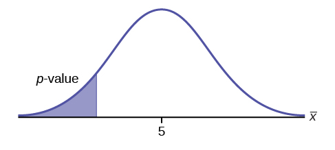{:}

Try It

*H0*: *μ* = 10, *Ha*: *μ* &lt; 10

Assume the *p*-value is 0.0935. What type of test is this? Draw the picture of the *p*-value.

left-tailed test

{:}

*H0*\: *p* ≤ 0.2  *Ha*\: *p* &gt; 0.2

This is a test of a single population proportion. *Ha* tells you the test is **right-tailed**. The picture of the *p*-value is as follows:

{:}

Try It

*H0*: *μ* ≤ 1, *Ha*: *μ* &gt; 1

Assume the *p*-value is 0.1243. What type of test is this? Draw the picture of the *p*-value.

right-tailed test

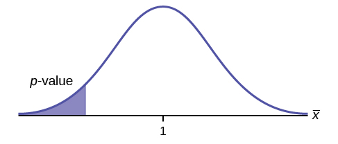{:}

*H0*\: *p* = 50  *Ha*\: *p* ≠ 50

This is a test of a single population mean. *Ha* tells you the test is **two-tailed**. The picture of the *p*-value is as follows.

{:}

Try It

*H0*: *p* = 0.5, *Ha*: *p* ≠ 0.5

Assume the *p*-value is 0.2564. What type of test is this? Draw the picture of the *p*-value.

two-tailed test

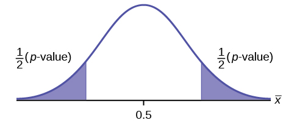{:}

# Full Hypothesis Test Examples

Jeffrey, as an eight-year old, **established a mean time of 16.43 seconds** for swimming the 25-yard freestyle, with a **standard deviation of 0.8 seconds**. His dad, Frank, thought that Jeffrey could swim the 25-yard freestyle faster using goggles. Frank bought Jeffrey a new pair of expensive goggles and timed Jeffrey for **15 25-yard freestyle swims**. For the 15 swims, **Jeffrey's mean time was 16 seconds. Frank thought that the goggles helped Jeffrey to swim faster than the 16.43 seconds.** Conduct a hypothesis test using a preset *α* = 0.05. Assume that the swim times for the 25-yard freestyle are normal.

Set up the Hypothesis Test:

Since the problem is about a mean, this is a **test of a single population mean**.

*H0*: *μ* = 16.43  *Ha*: *μ* &lt; 16.43

For Jeffrey to swim faster, his time will be less than 16.43 seconds. The "&lt;" tells you this is left-tailed.

Determine the distribution needed:

<strong>Random variable: </strong><math xmlns="http://www.w3.org/1998/Math/MathML"><apply><conjugate /><mi>X</mi></apply></math>

 = the mean time to swim the 25-yard freestyle.

<strong> Distribution for the test: </strong> <math xmlns="http://www.w3.org/1998/Math/MathML"><apply><conjugate /><mi>X</mi></apply></math>

 is normal (population **standard deviation**{: data-type="term"} is known: *σ* = 0.8)

<math xmlns="http://www.w3.org/1998/Math/MathML"> <mrow> <mover accent="true"> <mi>X</mi> <mo>¯</mo> </mover> <mo>~</mo><mi>N</mi><mrow><mo>(</mo> <mrow> <mi>μ</mi><mo>,</mo><mfrac> <mrow> <msub> <mi>σ</mi> <mi>X</mi> </msub> </mrow> <mrow> <msqrt> <mi>n</mi> </msqrt> </mrow> </mfrac> </mrow> <mo>)</mo></mrow> </mrow> </math>

 Therefore, <math xmlns="http://www.w3.org/1998/Math/MathML"> <mrow> <mover accent="true"> <mi>X</mi> <mo>¯</mo> </mover> <mo>~</mo><mi>N</mi><mrow><mo>(</mo> <mrow> <mn>16.43</mn><mo>,</mo><mfrac> <mrow> <mn>0.8</mn> </mrow> <mrow> <msqrt> <mrow> <mn>15</mn> </mrow> </msqrt> </mrow> </mfrac> </mrow> <mo>)</mo></mrow> </mrow> </math>

*μ* = 16.43 comes from *H0* and not the data. *σ* = 0.8, and *n* = 15.

Calculate the *p*-value using the normal distribution for a mean:

*p*-value = *P*(<math xmlns="http://www.w3.org/1998/Math/MathML"> <mover accent="true"> <mi>x</mi> <mo>¯</mo> </mover> </math>

 &lt; 16) = 0.0187 where the sample mean in the problem is given as 16.

*p*-value = 0.0187 (This is called the **actual level of significance**.) The *p*-value is the area to the left of the sample mean is given as 16.

**Graph:**

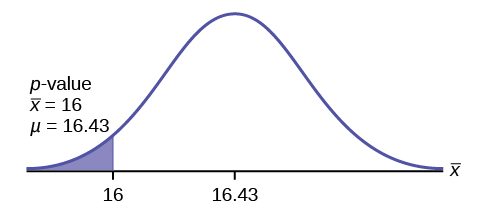{: #hyptest11_ex1}

*μ* = 16.43 comes from *H0*. Our assumption is *μ* = 16.43.

**Interpretation of the *p*-value: If *H0* is true**, there is a 0.0187 probability (1.87%)that Jeffrey's mean time to swim the 25-yard freestyle is 16 seconds or less. Because a 1.87% chance is small, the mean time of 16 seconds or less is unlikely to have happened randomly. It is a rare event.

Compare *α* and the *p*-value:

*α* = 0.05 *p*-value = 0.0187 *α* &gt; *p*-value

**Make a decision:** Since *α* &gt; *p*-value, reject *H0*.

<!-- CONTINUE HERE -->

This means that you reject *μ* = 16.43. In other words, you do not think Jeffrey swims the 25-yard freestyle in 16.43 seconds but faster with the new goggles.

**Conclusion:** At the 5% significance level, we conclude that Jeffrey swims faster using the new goggles. The sample data show there is sufficient evidence that Jeffrey's mean time to swim the 25-yard freestyle is less than 16.43 seconds.

The *p*-value can easily be calculated.

Press `STAT` and arrow over to `TESTS`. Press `1:Z-Test`. Arrow over to `Stats` and press `ENTER`. Arrow down and enter 16.43 for *μ0* (null hypothesis), .8 for *σ*, 16 for the sample mean, and 15 for *n*. Arrow down to *μ* : (alternate hypothesis) and arrow over to &lt; *μ0*. Press `ENTER`. Arrow down to `Calculate` and press `ENTER`. The calculator not only calculates the *p*-value (*p* = 0.0187) but it also calculates the test statistic (*z*-score) for the sample mean. *μ* &lt; 16.43 is the alternative hypothesis. Do this set of instructions again except arrow to `Draw`(instead of `Calculate`). Press `ENTER`. A shaded graph appears with *z* = -2.08 (test statistic) and *p* = 0.0187 (*p*-value). Make sure when you use `Draw` that no other equations are highlighted in *Y* = and the plots are turned off.

When the calculator does a *Z*-Test, the `Z-Test` function finds the *p*-value by doing a normal probability calculation using the **central limit theorem**{: data-type="term"}:

<math xmlns="http://www.w3.org/1998/Math/MathML"> <mrow> <mi>P</mi><mo stretchy="false">(</mo><mover accent="true"> <mi>x</mi> <mo>¯</mo> </mover> <mo>&lt;</mo><mn>16</mn><mo stretchy="false">)</mo><mo>=</mo> </mrow> </math>

 `2nd DISTR normcdf` <math xmlns="http://www.w3.org/1998/Math/MathML"> <mrow> <mrow><mo>(</mo> <mrow> <mo>−</mo><mn>10</mn><mo>^</mo><mn>99</mn><mo>,</mo><mn>16</mn><mo>,</mo><mn>16.43</mn><mo>,</mo><mn>0.8</mn><mo>/</mo><msqrt> <mrow> <mn>15</mn> </mrow> </msqrt> </mrow> <mo>)</mo></mrow> </mrow> </math>

 .

The Type I and Type II errors for this problem are as follows:

The Type I error is to conclude that Jeffrey swims the 25-yard freestyle, on average, in less than 16.43 seconds when, in fact, he actually swims the 25-yard freestyle, on average, in 16.43 seconds. (Reject the null hypothesis when the null hypothesis is true.)

The Type II error is that there is not evidence to conclude that Jeffrey swims the 25-yard free-style, on average, in less than 16.43 seconds when, in fact, he actually does swim the 25-yard free-style, on average, in less than 16.43 seconds. (Do not reject the null hypothesis when the null hypothesis is false.)

Try It

The mean throwing distance of a football for a Marco, a high school freshman quarterback, is 40 yards, with a standard deviation of two yards. The team coach tells Marco to adjust his grip to get more distance. The coach records the distances for 20 throws. For the 20 throws, Marco’s mean distance was 45 yards. The coach thought the different grip helped Marco throw farther than 40 yards. Conduct a hypothesis test using a preset *α* = 0.05. Assume the throw distances for footballs are normal.

First, determine what type of test this is, set up the hypothesis test, find the *p*-value, sketch the graph, and state your conclusion.

Press STAT and arrow over to TESTS. Press 1:Z-Test. Arrow over to Stats and press ENTER. Arrow down and enter 40 for *μ*0 (null hypothesis), 2 for *σ*, 45 for the sample mean, and 20 for *n*. Arrow down to *μ*: (alternative hypothesis) and set it either as &lt;, ≠, or &gt;. Press ENTER. Arrow down to Calculate and press ENTER. The calculator not only calculates the *p*-value but it also calculates the test statistic (*z*-score) for the sample mean. Select &lt;, ≠, or &gt; for the alternative hypothesis. Do this set of instructions again except arrow to Draw (instead of Calculate). Press ENTER. A shaded graph appears with test statistic and *p*-value. Make sure when you use Draw that no other equations are highlighted in *Y* = and the plots are turned off.

Since the problem is about a mean, this is a test of a single population mean.

*H0* : *μ* = 40

*Ha* : *μ* &gt; 40

*p* = 0.0062

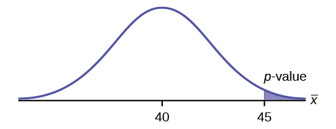{:}

Because *p* &lt; *α*, we reject the null hypothesis. There is sufficient evidence to suggest that the change in grip improved Marco’s throwing distance.

Historical Note ([[link]](#fs-idp41487520))

The traditional way to compare the two probabilities, *α* and the *p*-value, is to compare the critical value (*z*-score from *α*) to the test statistic (*z*-score from data). The calculated test statistic for the *p*-value is –2.08. (From the Central Limit Theorem, the test statistic formula is <math xmlns="http://www.w3.org/1998/Math/MathML"> <mrow> <mi>z</mi><mo>=</mo><mfrac> <mrow> <mover accent="true"> <mi>x</mi> <mo>¯</mo> </mover> <mo>−</mo><msub> <mi>μ</mi> <mi>X</mi> </msub> </mrow> <mrow> <mo stretchy="false">(</mo><mfrac> <mrow> <msub> <mi>σ</mi> <mi>X</mi> </msub> </mrow> <mrow> <msqrt> <mi>n</mi> </msqrt> </mrow> </mfrac> <mo stretchy="false">)</mo> </mrow> </mfrac> </mrow> </math>

. <!--LINK THIS PLEASE --> For this problem, <math xmlns="http://www.w3.org/1998/Math/MathML"> <mover accent="true"> <mi>x</mi> <mo>¯</mo> </mover> </math>

 = 16, *μX* = 16.43 from the null hypothes is, *σX* = 0.8, and *n* = 15.) You can find the critical value for *α* = 0.05 in the normal table (see **15.Tables** in the Table of Contents). The *z*-score for an area to the left equal to 0.05 is midway between –1.65 and –1.64 (0.05 is midway between 0.0505 and 0.0495). The *z*-score is –1.645. Since –1.645 &gt; –2.08 (which demonstrates that α &gt; *p*-value), reject *H0*. Traditionally, the decision to reject or not reject was done in this way. Today, comparing the two probabilities *α* and the *p*-value is very common. For this problem, the *p*-value, 0.0187 is considerably smaller than *α*, 0.05. You can be confident about your decision to reject. The graph shows *α*, the *p*-value, and the test statistics and the critical value.

{: #eip-idm47467424}

A college football coach thought that his players could bench press a **mean weight of 275 pounds**. It is known that the **standard deviation is 55 pounds**. Three of his players thought that the mean weight was **more than** that amount. They asked **30** of their teammates for their estimated maximum lift on the bench press exercise. The data ranged from 205 pounds to 385 pounds. The actual different weights were (frequencies are in parentheses)  205(3) 215(3) 225(1) 241(2) 252(2) 265(2) 275(2) 313(2) 316(5) 338(2) 341(1) 345(2) 368(2) 385(1).

Conduct a hypothesis test using a 2.5% level of significance to determine if the bench press mean is **more than 275 pounds**.

Set up the Hypothesis Test:

Since the problem is about a mean weight, this is a **test of a single population mean**.

*H0*: *μ* = 275* * *
{: data-type="newline"}

*Ha*: *μ* &gt; 275* * *
{: data-type="newline"}

This is a right-tailed test.

Calculating the distribution needed:

Random variable: <math xmlns="http://www.w3.org/1998/Math/MathML"> <mover accent="true"> <mi>X</mi> <mo>¯</mo> </mover> </math>

 = the mean weight, in pounds, lifted by the football players.

**Distribution for the test:** It is normal because *σ* is known.

<math xmlns="http://www.w3.org/1998/Math/MathML"> <mrow> <mover accent="true"> <mi>X</mi> <mo>¯</mo> </mover> <mo>~</mo><mi>N</mi><mrow><mo>(</mo> <mrow> <mn>275</mn><mo>,</mo><mfrac> <mrow> <mn>55</mn> </mrow> <mrow> <msqrt> <mrow> <mn>30</mn> </mrow> </msqrt> </mrow> </mfrac> </mrow> <mo>)</mo></mrow> </mrow> </math>

<math xmlns="http://www.w3.org/1998/Math/MathML"> <mrow> <mover accent="true"> <mi>x</mi> <mo>¯</mo> </mover> <mo>=</mo><mn>286.2</mn> </mrow> </math>

 pounds (from the data).

*σ* = 55 pounds **(Always use *σ* if you know it.)** We assume *μ* = 275 pounds unless our data shows us otherwise.

Calculate the *p*-value using the normal distribution for a mean and using the sample mean as input (see [[link]](/m47896) for using the data as input):

<math xmlns="http://www.w3.org/1998/Math/MathML"> <mrow> <mi>p</mi><mtext>-value</mtext><mo>=</mo><mi>P</mi><mo stretchy="false">(</mo><mover accent="true"> <mi>x</mi> <mo>¯</mo> </mover> <mo>&gt;</mo><mn>286.2</mn><mo stretchy="false">)</mo><mo>=</mo><mn>0.1323</mn> </mrow> </math>

.

**Interpretation of the *p*-value:** If *H0* is true, then there is a 0.1331 probability (13.23%) that the football players can lift a mean weight of 286.2 pounds or more. Because a 13.23% chance is large enough, a mean weight lift of 286.2 pounds or more is not a rare event.

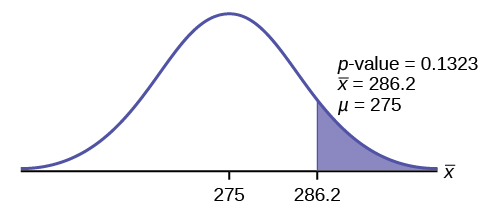{: #hyptest11_ex3}

Compare *α* and the *p*-value:

*α* = 0.025 *p*-value = 0.1323

**Make a decision:** Since *α* &lt;*p*-value, do not reject *H0*.

**Conclusion:** At the 2.5% level of significance, from the sample data, there is not sufficient evidence to conclude that the true mean weight lifted is more than 275 pounds.

The *p*-value can easily be calculated.

Put the data and frequencies into lists. Press `STAT` and arrow over to `TESTS`. Press `1:Z-Test`. Arrow over to `Data` and press `ENTER`. Arrow down and enter 275 for *μ0*, 55 for *σ*, the name of the list where you put the data, and the name of the list where you put the frequencies. Arrow down to *μ:* and arrow over to &gt; *μ0*. Press `ENTER`. Arrow down to `Calculate` and press `ENTER`. The calculator not only calculates the *p*-value (*p* = 0.1331, a little different from the previous calculation - in it we used the sample mean rounded to one decimal place instead of the data) but it also calculates the test statistic (*z*-score) for the sample mean, the sample mean, and the sample standard deviation. *μ* &gt; 275 is the alternative hypothesis. Do this set of instructions again except arrow to `Draw` (instead of `Calculate`). Press `ENTER`. A shaded graph appears with *z* = 1.112 (test statistic) and *p* = 0.1331 (*p*-value). Make sure when you use `Draw` that no other equations are highlighted in *Y* = and the plots are turned off.

Statistics students believe that the mean score on the first statistics test is 65. A statistics instructor thinks the mean score is higher than 65. He samples ten statistics students and obtains the scores  65 65 70 67 66 63 63 68 72 71. He performs a hypothesis test using a 5% level of significance. The data are assumed to be from a normal distribution.

Set up the hypothesis test:

A 5% level of significance means that *α* = 0.05. This is a test of a **single population mean**.

*H0*: *μ* = 65  *Ha*: *μ* &gt; 65

Since the instructor thinks the average score is higher, use a "&gt;". The "&gt;" means the test is right-tailed.

Determine the distribution needed:

**Random variable:** <math xmlns="http://www.w3.org/1998/Math/MathML"> <mover accent="true"> <mi>X</mi> <mo>¯</mo> </mover> </math>

 = average score on the first statistics test.

<strong> Distribution for the test:</strong> If you read the problem carefully, you will notice that there is **no population standard deviation given**. You are only given *n* = 10 sample data values. Notice also that the data come from a normal distribution. This means that the distribution for the test is a student's *t*.

Use *t*df. Therefore, the distribution for the test is *t*9 where *n* = 10 and *df* = 10 - 1 = 9.

Calculate the *p*-value using the Student's *t*-distribution:

*p*-value = *P*(<math xmlns="http://www.w3.org/1998/Math/MathML"> <mover accent="true"> <mi>x</mi> <mo>¯</mo> </mover> </math>

 &gt; 67) = 0.0396 where the sample mean and sample standard deviation are calculated as 67 and 3.1972 from the data.

**Interpretation of the *p*-value:** If the null hypothesis is true, then there is a 0.0396 probability (3.96%) that the sample mean is 65 or more.

{: #hyptest11_ex4}

Compare *α* and the *p*-value:

Since *α* = 0.05 and *p*-value = 0.0396. *α* &gt; *p*-value.

**Make a decision:** Since *α* &gt; *p*-value, reject *H0*.

This means you reject *μ* = 65. In other words, you believe the average test score is more than 65.

**Conclusion:** At a 5% level of significance, the sample data show sufficient evidence that the mean (average) test score is more than 65, just as the math instructor thinks.

The *p*-value can easily be calculated.

Put the data into a list. Press `STAT` and arrow over to `TESTS`. Press `2:T-Test`. Arrow over to `Data` and press `ENTER`. Arrow down and enter 65 for *μ*0, the name of the list where you put the data, and 1 for `Freq:`. Arrow down to *μ*: and arrow over to &gt; *μ*0. Press `ENTER`. Arrow down to `Calculate` and press `ENTER`. The calculator not only calculates the *p*-value (*p* = 0.0396) but it also calculates the test statistic (*t*-score) for the sample mean, the sample mean, and the sample standard deviation. *μ* &gt; 65 is the alternative hypothesis. Do this set of instructions again except arrow to `Draw` (instead of `Calculate`). Press `ENTER`. A shaded graph appears with *t* = 1.9781 (test statistic) and *p* = 0.0396 (*p*-value). Make sure when you use `Draw` that no other equations are highlighted in *Y* = and the plots are turned off.

Try It

It is believed that a stock price for a particular company will grow at a rate of $5 per week with a standard deviation of $1. An investor believes the stock won’t grow as quickly. The changes in stock price is recorded for ten weeks and are as follows: $4, $3, $2, $3, $1, $7, $2, $1, $1, $2. Perform a hypothesis test using a 5% level of significance. State the null and alternative hypotheses, find the *p*-value, state your conclusion, and identify the Type I and Type II errors.

*H0*: *μ* = 5

*Ha*: *μ* &lt; 5

*p* = 0.0082

Because *p* &lt; *α*, we reject the null hypothesis. There is sufficient evidence to suggest that the stock price of the company grows at a rate less than $5 a week.

Type I Error: To conclude that the stock price is growing slower than $5 a week when, in fact, the stock price is growing at $5 a week (reject the null hypothesis when the null hypothesis is true).

Type II Error: To conclude that the stock price is growing at a rate of $5 a week when, in fact, the stock price is growing slower than $5 a week (do not reject the null hypothesis when the null hypothesis is false).

Joon believes that 50% of first-time brides in the United States are younger than their grooms. She performs a hypothesis test to determine if the percentage is **the same or different from 50%**. Joon samples **100 first-time brides** and **53** reply that they are younger than their grooms. For the hypothesis test, she uses a 1% level of significance.

Set up the hypothesis test:

The 1% level of significance means that *α* = 0.01. This is a **test of a single population proportion**.

*H0*: *p* = 0.50  *Ha*: *p* ≠ 0.50

The words **"is the same or different from"** tell you this is a two-tailed test.

Calculate the distribution needed:

**Random variable:** *P′* = the percent of of first-time brides who are younger than their grooms.

**Distribution for the test:** The problem contains no mention of a mean. The information is given in terms of percentages. Use the distribution for *P′*, the estimated proportion.

<math xmlns="http://www.w3.org/1998/Math/MathML"> <mrow> <msup> <mi>P</mi> <mo>′</mo> </msup> <mo>~</mo><mi>N</mi><mrow><mo>(</mo> <mrow> <mi>p</mi><mo>,</mo><msqrt> <mrow> <mfrac> <mrow> <mi>p</mi><mo>⋅</mo><mi>q</mi> </mrow> <mi>n</mi> </mfrac> </mrow> </msqrt> </mrow> <mo>)</mo></mrow> </mrow> </math>

 Therefore, <math xmlns="http://www.w3.org/1998/Math/MathML"> <msup> <mi>P</mi> <mo>′</mo> </msup> <mo>~</mo><mi>N</mi><mrow><mo>(</mo> <mrow> <mn>0.5</mn><mo>,</mo><msqrt> <mrow> <mfrac> <mrow> <mn>0.5</mn><mo>⋅</mo><mn>0.5</mn> </mrow> <mrow> <mn>100</mn> </mrow> </mfrac> </mrow> </msqrt> </mrow> <mo>)</mo></mrow> </math>

where *p* = 0.50, *q* = 1−*p* = 0.50, and *n* = 100

Calculate the *p*-value using the normal distribution for proportions:

*p*-value = *P* (*p′* &lt; 0.47 or *p′* &gt; 0.53) = 0.5485

where *x* = 53, *p′* = <math xmlns="http://www.w3.org/1998/Math/MathML"> <mrow> <mfrac> <mi>x</mi> <mi>n</mi> </mfrac> <mtext> = </mtext><mfrac> <mrow> <mtext>53</mtext> </mrow> <mrow> <mtext>100</mtext> </mrow> </mfrac> </mrow> </math>

 = 0.53.

**Interpretation of the *p*-value:** If the null hypothesis is true, there is 0.5485 probability (54.85%) that the sample (estimated) proportion <math xmlns="http://www.w3.org/1998/Math/MathML"><mi>p</mi><mo>'</mo></math>

 is 0.53 or more OR 0.47 or less (see the graph in [[link]](#hyptest11_ex5)).

{: #hyptest11_ex5}

*μ* = *p* = 0.50 comes from *H0*, the null hypothesis.

*p′* = 0.53. Since the curve is symmetrical and the test is two-tailed, the *p′* for the left tail is equal to 0.50 – 0.03 = 0.47 where *μ* = *p* = 0.50. (0.03 is the difference between 0.53 and 0.50.)

Compare *α* and the *p*-value:

Since *α* = 0.01 and *p*-value = 0.5485. *α* &lt; *p*-value.

**Make a decision:** Since *α* &lt; *p*-value, you cannot reject *H0*.

**Conclusion:** At the 1% level of significance, the sample data do not show sufficient evidence that the percentage of first-time brides who are younger than their grooms is different from 50%.

The *p*-value can easily be calculated.

Press `STAT` and arrow over to `TESTS`. Press `5:1-PropZTest`. Enter .5 for *p*0, 53 for *x* and 100 for *n*. Arrow down to `Prop` and arrow to `not equals` *p*0. Press `ENTER`. Arrow down to `Calculate` and press `ENTER`. The calculator calculates the *p*-value (*p* = 0.5485) and the test statistic (*z*-score). `Prop not equals` .5 is the alternate hypothesis. Do this set of instructions again except arrow to `Draw` (instead of `Calculate`). Press `ENTER`. A shaded graph appears with *z* = 0.6 (test statistic) and *p* = 0.5485 (*p*-value). Make sure when you use `Draw` that no other equations are highlighted in *Y* = and the plots are turned off.

The Type I and Type II errors are as follows:

The Type I error is to conclude that the proportion of first-time brides who are younger than their grooms is different from 50% when, in fact, the proportion is actually 50%. (Reject the null hypothesis when the null hypothesis is true).

The Type II error is there is not enough evidence to conclude that the proportion of first time brides who are younger than their grooms differs from 50% when, in fact, the proportion does differ from 50%. (Do not reject the null hypothesis when the null hypothesis is false.)

Try It

A teacher believes that 85% of students in the class will want to go on a field trip to the local zoo. She performs a hypothesis test to determine if the percentage is the same or different from 85%. The teacher samples 50 students and 39 reply that they would want to go to the zoo. For the hypothesis test, use a 1% level of significance.

First, determine what type of test this is, set up the hypothesis test, find the *p*-value, sketch the graph, and state your conclusion.

Since the problem is about percentages, this is a test of single population proportions.

*H0* : *p* = 0.85

*Ha*: *p* ≠ 0.85

*p* = 0.7554

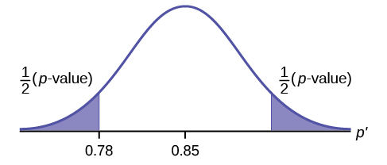{:}

Because *p* &gt; *α*, we fail to reject the null hypothesis. There is not sufficient evidence to suggest that the proportion of students that want to go to the zoo is not 85%.

Suppose a consumer group suspects that the proportion of households that have three cell phones is 30%. A cell phone company has reason to believe that the proportion is not 30%. Before they start a big advertising campaign, they conduct a hypothesis test. Their marketing people survey 150 households with the result that 43 of the households have three cell phones.

Set up the Hypothesis Test:

*H0*: *p* = 0.30 *Ha*: *p* ≠ 0.30

Determine the distribution needed:

The **random variable** is *P′* = proportion of households that have three cell phones.

The **distribution** for the hypothesis test is <math xmlns="http://www.w3.org/1998/Math/MathML"> <mrow> <mi>P</mi><mo>'</mo><mo>~</mo><mi>N</mi><mrow><mo>(</mo> <mrow> <mn>0.30</mn><mo>,</mo><msqrt> <mrow> <mfrac> <mrow> <mo stretchy="false">(</mo><mn>0.30</mn><mo stretchy="false">)</mo><mo>⋅</mo><mo stretchy="false">(</mo><mn>0.70</mn><mo stretchy="false">)</mo> </mrow> <mrow> <mn>150</mn> </mrow> </mfrac> </mrow> </msqrt> </mrow> <mo>)</mo></mrow> </mrow> </math>

* * *
{: data-type="newline" data-count="2"}

a. The value that helps determine the *p*-value is *p′*. Calculate *p′*.

a. *p′* = <math xmlns="http://www.w3.org/1998/Math/MathML"> <mrow> <mfrac> <mi>x</mi> <mi>n</mi> </mfrac> </mrow> </math>

 where *x* is the number of successes and *n* is the total number in the sample.

*x* = 43, *n* = 150

*p′* = <math xmlns="http://www.w3.org/1998/Math/MathML"> <mrow> <mfrac> <mrow> <mtext>43</mtext> </mrow> <mrow> <mtext>150</mtext> </mrow> </mfrac> </mrow> </math>

 * * *
{: data-type="newline" data-count="2"}

b. What is a **success** for this problem?

b. A success is having three cell phones in a household.* * *
{: data-type="newline" data-count="2"}

c. What is the level of significance?

c. The level of significance is the preset *α*. Since *α* is not given, assume that *α* = 0.05.* * *
{: data-type="newline" data-count="2"}

d. Draw the graph for this problem. Draw the horizontal axis. Label and shade appropriately.* * *
{: data-type="newline"}

Calculate the *p*-value.

d. *p*-value = 0.7216* * *
{: data-type="newline" data-count="2"}

e. Make a decision. \_\_\_\_\_\_\_\_\_\_\_\_\_(Reject/Do not reject) *H0* because\_\_\_\_\_\_\_\_\_\_\_\_.

e. Assuming that *α* = 0.05, *α* &lt; *p*-value. The decision is do not reject *H0* because there is not sufficient evidence to conclude that the proportion of households that have three cell phones is not 30%.

Try It

Marketers believe that 92% of adults in the United States own a cell phone. A cell phone manufacturer believes that number is actually lower. 200 American adults are surveyed, of which, 174 report having cell phones. Use a 5% level of significance. State the null and alternative hypothesis, find the *p*-value, state your conclusion, and identify the Type I and Type II errors.

*H0*: *p* = 0.92

*Ha*: *p* &lt; 0.92

*p*-value = 0.0046

Because *p* &lt; 0.05, we reject the null hypothesis. There is sufficient evidence to conclude that fewer than 92% of American adults own cell phones.

Type I Error: To conclude that fewer than 92% of American adults own cell phones when, in fact, 92% of American adults do own cell phones (reject the null hypothesis when the null hypothesis is true).

Type II Error: To conclude that 92% of American adults own cell phones when, in fact, fewer than 92% of American adults own cell phones (do not reject the null hypothesis when the null hypothesis is false).

The next example is a poem written by a statistics student named Nicole Hart. The solution to the problem follows the poem. Notice that the hypothesis test is for a single population proportion. This means that the null and alternate hypotheses use the parameter *p*. The distribution for the test is normal. The estimated proportion *p*′ is the proportion of fleas killed to the total fleas found on Fido. This is sample information. The problem gives a preconceived *α* = 0.01, for comparison, and a 95% confidence interval computation. The poem is clever and humorous, so please enjoy it!

My dog has so many fleas,* * *
{: data-type="newline"}

 They do not come off with ease.* * *
{: data-type="newline"}

 As for shampoo, I have tried many types* * *
{: data-type="newline"}

 Even one called Bubble Hype,* * *
{: data-type="newline"}

 Which only killed 25% of the fleas,* * *
{: data-type="newline"}

 Unfortunately I was not pleased.* * *
{: data-type="newline" data-count="2"}

 I've used all kinds of soap,* * *
{: data-type="newline"}

 Until I had given up hope* * *
{: data-type="newline"}

 Until one day I saw* * *
{: data-type="newline"}

 An ad that put me in awe.* * *
{: data-type="newline" data-count="2"}

 A shampoo used for dogs* * *
{: data-type="newline"}

 Called GOOD ENOUGH to Clean a Hog* * *
{: data-type="newline"}

 Guaranteed to kill more fleas.* * *
{: data-type="newline" data-count="2"}

 I gave Fido a bath* * *
{: data-type="newline"}

 And after doing the math* * *
{: data-type="newline"}

 His number of fleas* * *
{: data-type="newline"}

 Started dropping by 3's!* * *
{: data-type="newline" data-count="2"}

 Before his shampoo* * *
{: data-type="newline"}

 I counted 42.* * *
{: data-type="newline"}

 At the end of his bath,* * *
{: data-type="newline"}

 I redid the math* * *
{: data-type="newline"}

 And the new shampoo had killed 17 fleas.* * *
{: data-type="newline"}

 So now I was pleased.* * *
{: data-type="newline" data-count="2"}

 Now it is time for you to have some fun* * *
{: data-type="newline"}

 With the level of significance being .01,* * *
{: data-type="newline"}

 You must help me figure out* * *
{: data-type="newline"}

 Use the new shampoo or go without?

Set up the hypothesis test:

*H0*: *p* ≤ 0.25   *Ha*: *p* &gt; 0.25

Determine the distribution needed:

In words, CLEARLY state what your random variable <math xmlns="http://www.w3.org/1998/Math/MathML"> <mover accent="true"> <mi>X</mi> <mo>¯</mo> </mover> </math>

 or *P′* represents.

*P′* = The proportion of fleas that are killed by the new shampoo

State the distribution to use for the test.

**Normal:** <math xmlns="http://www.w3.org/1998/Math/MathML"> <mrow> <mi>N</mi><mrow><mo>(</mo> <mrow> <mn>0.25</mn><mo>,</mo><msqrt> <mrow> <mfrac> <mrow> <mo stretchy="false">(</mo><mn>0.25</mn><mo stretchy="false">)</mo><mo stretchy="false">(</mo><mn>1</mn><mo>−</mo><mn>0.25</mn><mo stretchy="false">)</mo> </mrow> <mrow> <mn>42</mn> </mrow> </mfrac> </mrow> </msqrt> </mrow> <mo>)</mo></mrow> </mrow> </math>

**Test Statistic:** *z* = 2.3163

Calculate the *p*-value using the normal distribution for proportions:

*p*-value = 0.0103

In one to two complete sentences, explain what the *p*-value means for this problem.

If the null hypothesis is true (the proportion is 0.25), then there is a 0.0103 probability that the sample (estimated) proportion is 0.4048 <math xmlns="http://www.w3.org/1998/Math/MathML"><mo>(</mo><mfrac><mn>17</mn><mn>42</mn></mfrac><mo>)</mo></math>

 or more.

Use the previous information to sketch a picture of this situation. CLEARLY, label and scale the horizontal axis and shade the region(s) corresponding to the *p*-value.

{: #hyptest11_ex6}

Compare *α* and the *p*-value:

Indicate the correct decision (“reject” or “do not reject” the null hypothesis), the reason for it, and write an appropriate conclusion, using complete sentences.

| alpha | decision | reason for decision |
|----------
{: valign="middle"}| 0.01 | Do not reject <math xmlns="http://www.w3.org/1998/Math/MathML"><msub><mi>H</mi><mn>0</mn></msub></math>

 | *α* &lt; *p*-value |
{: #element-152 summary=""}

**Conclusion:** At the 1% level of significance, the sample data do not show sufficient evidence that the percentage of fleas that are killed by the new shampoo is more than 25%.

Construct a 95% confidence interval for the true mean or proportion. Include a sketch of the graph of the situation. Label the point estimate and the lower and upper bounds of the confidence interval.

{: #hyptest11_ex7}

**Confidence Interval:** (0.26,0.55) We are 95% confident that the true population proportion *p* of fleas that are killed by the new shampoo is between 26% and 55%.

Note

This test result is not very definitive since the *p*-value is very close to alpha. In reality, one would probably do more tests by giving the dog another bath after the fleas have had a chance to return.

The National Institute of Standards and Technology provides exact data on conductivity properties of materials. Following are conductivity measurements for 11 randomly selected pieces of a particular type of glass.

1\.11; 1.07; 1.11; 1.07; 1.12; 1.08; .98; .98 1.02; .95; .95 * * *
{: data-type="newline"}

Is there convincing evidence that the average conductivity of this type of glass is greater than one? Use a significance level of 0.05. Assume the population is normal.

Let’s follow a four-step process to answer this statistical question. **State the Question**: We need to determine if, at a 0.05 significance level, the average conductivity of the selected glass is greater than one. Our hypotheses will be  *H0*: *μ* ≤ 1 *Ha*: *μ* &gt; 1  **Plan**: We are testing a sample mean without a known population standard deviation. Therefore, we need to use a Student's-t distribution. Assume the underlying population is normal. **Do the calculations**: We will input the sample data into the TI-83 as follows. 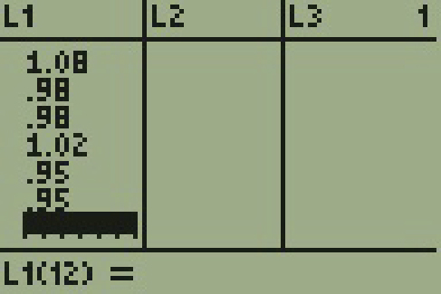{: #eip-idp122053552}

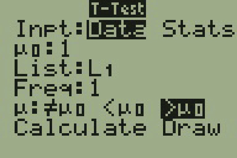{: #eip-idp29927184}

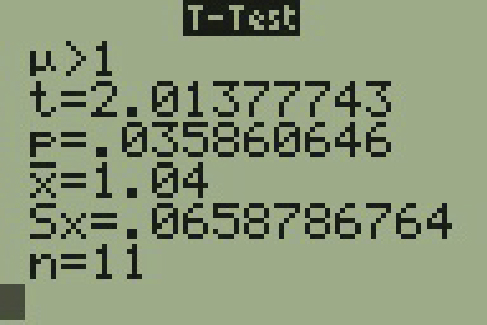{: #eip-idp126675984}

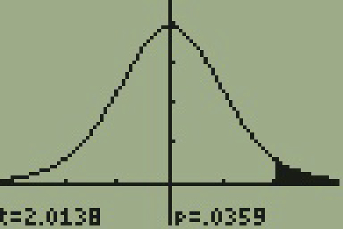{: #eip-idp154420944}

 **State the Conclusions**: Since the *p*-value* (*p* = 0.036) is less than our alpha value, we will reject the null hypothesis. It is reasonable to state that the data supports the claim that the average conductivity level is greater than one. 

In a study of 420,019 cell phone users, 172 of the subjects developed brain cancer. Test the claim that cell phone users developed brain cancer at a greater rate than that for non-cell phone users (the rate of brain cancer for non-cell phone users is 0.0340%). Since this is a critical issue, use a 0.005 significance level. Explain why the significance level should be so low in terms of a Type I error.

We will follow the four-step process.

1.  We need to conduct a hypothesis test on the claimed cancer rate. Our hypotheses will be
    1.  *H0*: *p* ≤ 0.00034
    2.  *Ha*: *p* &gt; 0.00034
    {: data-number-style="lower-alpha"}
    
    If we commit a Type I error, we are essentially accepting a false claim. Since the claim describes cancer-causing environments, we want to minimize the chances of incorrectly identifying causes of cancer.
    {: .finger}

2.  We will be testing a sample proportion with *x* = 172 and *n* = 420,019. The sample is sufficiently large because we have *np* = 420,019(0.00034) = 142.8, *nq* = 420,019(0.99966) = 419,876.2, two independent outcomes, and a fixed probability of success *p* = 0.00034. Thus we will be able to generalize our results to the population.
3.  The associated TI results are
    * * *
    {: data-type="newline"}
    
    {:}

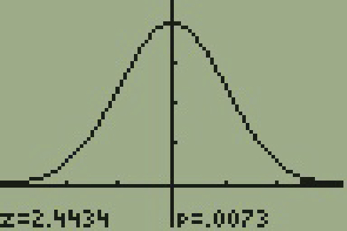{: #eip-idp38098208}

4.  Since the *p*-value = 0.0073 is greater than our alpha value = 0.005, we cannot reject the null. Therefore, we conclude that there is not enough evidence to support the claim of higher brain cancer rates for the cell phone users.
{: data-number-style="arabic"}

According to the US Census there are approximately 268,608,618 residents aged 12 and older. Statistics from the Rape, Abuse, and Incest National Network indicate that, on average, 207,754 rapes occur each year (male and female) for persons aged 12 and older. This translates into a percentage of sexual assaults of 0.078%. In Daviess County, KY, there were reported 11 rapes for a population of 37,937. Conduct an appropriate hypothesis test to determine if there is a statistically significant difference between the local sexual assault percentage and the national sexual assault percentage. Use a significance level of 0.01.

We will follow the four-step plan.

1.  We need to test whether the proportion of sexual assaults in Daviess County, KY is significantly different from the national average.
2.  Since we are presented with proportions, we will use a one-proportion *z*-test. The hypotheses for the test will be
    1.  *H0*: *p* = 0.00078
    2.  *Ha*: *p* ≠ 0.00078
    {: data-number-style="lower-alpha"}

3.  The following screen shots display the summary statistics from the hypothesis test. {:}

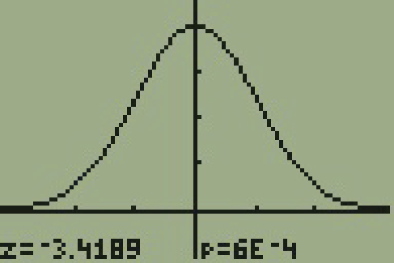{: #eip-idp38471600}

4.  Since the *p*-value, *p* = 0.00063, is less than the alpha level of 0.01, the sample data indicates that we should reject the null hypothesis. In conclusion, the sample data support the claim that the proportion of sexual assaults in Daviess County, Kentucky is different from the national average proportion.
{: data-number-style="arabic"}

# Chapter Review

The **hypothesis test**{: data-type="term"} itself has an established process. This can be summarized as follows: Determine *H0* and *Ha*. Remember, they are contradictory. Determine the random variable. Determine the distribution for the test. Draw a graph, calculate the test statistic, and use the test statistic to calculate the ***p*-value**{: data-type="term"}. (A *z*-score and a *t*-score are examples of test statistics.) Compare the preconceived *α* with the *p*-value, make a decision (reject or do not reject *H0*), and write a clear conclusion using English sentences. 

Notice that in performing the hypothesis test, you use *α* and not *β*. *β* is needed to help determine the sample size of the data that is used in calculating the *p*-value. Remember that the quantity 1 – *β* is called the **Power of the Test**. A high power is desirable. If the power is too low, statisticians typically increase the sample size while keeping *α* the same.If the power is low, the null hypothesis might not be rejected when it should be.

<section data-depth="1" id="eip-213" class="practice" markdown="1">

Assume *H0*: *μ* = 9 and *Ha*: *μ* &lt; 9. Is this a left-tailed, right-tailed, or two-tailed test?

This is a left-tailed test.

Assume *H0*: *μ* ≤ 6 and *Ha*: *μ* &gt; 6. Is this a left-tailed, right-tailed, or two-tailed test?

Assume *H0*: *p* = 0.25 and *Ha*: *p* ≠ 0.25. Is this a left-tailed, right-tailed, or two-tailed test?

This is a two-tailed test.

Draw the general graph of a left-tailed test.

Draw the graph of a two-tailed test.

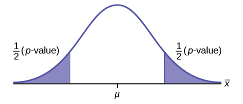{:}

A bottle of water is labeled as containing 16 fluid ounces of water. You believe it is less than that. What type of test would you use?

Your friend claims that his mean golf score is 63. You want to show that it is higher than that. What type of test would you use?

a right-tailed test

A bathroom scale claims to be able to identify correctly any weight within a pound. You think that it cannot be that accurate. What type of test would you use?

You flip a coin and record whether it shows heads or tails. You know the probability of getting heads is 50%, but you think it is less for this particular coin. What type of test would you use?

a left-tailed test

If the alternative hypothesis has a not equals ( ≠ ) symbol, you know to use which type of test?

Assume the null hypothesis states that the mean is at least 18. Is this a left-tailed, right-tailed, or two-tailed test?

This is a left-tailed test.

Assume the null hypothesis states that the mean is at most 12. Is this a left-tailed, right-tailed, or two-tailed test?

Assume the null hypothesis states that the mean is equal to 88. The alternative hypothesis states that the mean is not equal to 88. Is this a left-tailed, right-tailed, or two-tailed test?

This is a two-tailed test.

<!--moved from 9.3-->

</section>

# Homework

*For each of the word problems, use a solution sheet to do the hypothesis test. The solution sheet is found in [\[link\]](/m47882). Please feel free to make copies of the solution sheets. For the online version of the book, it is suggested that you copy the .doc or the .pdf files.*

Note

If you are using a Student\'s-*t* distribution for one of the following homework problems, you may assume that the underlying population is normally distributed. (In general, you must first prove that assumption, however.)

A particular brand of tires claims that its deluxe tire averages at least 50,000 miles before it needs to be replaced. From past studies of this tire, the standard deviation is known to be 8,000. A survey of owners of that tire design is conducted. From the 28 tires surveyed, the mean lifespan was 46,500 miles with a standard deviation of 9,800 miles. Using alpha = 0.05, is the data highly inconsistent with the claim?

1.  *H0*: *μ* ≥ 50,000
2.  *Ha*: *μ* &lt; 50,000
3.  Let
    <math xmlns="http://www.w3.org/1998/Math/MathML"> <mover accent="true"> <mi>X</mi> <mo>¯</mo> </mover> </math>
    
    = the average lifespan of a brand of tires.
4.  normal distribution
5.  *z* = -2.315
6.  *p*-value = 0.0103
7.  Check student’s solution.
8.  1.  alpha: 0.05
    2.  Decision: Reject the null hypothesis.
    3.  Reason for decision: The *p*-value is less than 0.05.
    4.  Conclusion: There is sufficient evidence to conclude that the mean lifespan of the tires is less than 50,000 miles.
    {: data-number-style="lower-roman"}

9.  (43,537, 49,463)
{: data-number-style="lower-alpha"}

From generation to generation, the mean age when smokers first start to smoke varies. However, the standard deviation of that age remains constant of around 2.1 years. A survey of 40 smokers of this generation was done to see if the mean starting age is at least 19. The sample mean was 18.1 with a sample standard deviation of 1.3. Do the data support the claim at the 5% level?

The cost of a daily newspaper varies from city to city. However, the variation among prices remains steady with a standard deviation of 20¢. A study was done to test the claim that the mean cost of a daily newspaper is $1.00. Twelve costs yield a mean cost of 95¢ with a standard deviation of 18¢. Do the data support the claim at the 1% level?

1.  *H0*: *μ* = $1.00
2.  *Ha*: *μ* ≠ $1.00
3.  Let
    <math xmlns="http://www.w3.org/1998/Math/MathML"> <mover accent="true"> <mi>X</mi> <mo>¯</mo> </mover> </math>
    
    = the average cost of a daily newspaper.
4.  normal distribution
5.  *z* = –0.866
6.  *p*-value = 0.3865
7.  Check student’s solution.
8.  1.  Alpha: 0.01
    2.  Decision: Do not reject the null hypothesis.
    3.  Reason for decision: The *p*-value is greater than 0.01.
    4.  Conclusion: There is sufficient evidence to support the claim that the mean cost of daily papers is $1. The mean cost could be $1.
    {: data-number-style="lower-roman"}

9.  ($0.84, $1.06)
{: data-number-style="lower-alpha"}

An article in the *San Jose Mercury News* stated that students in the California state university system take 4.5 years, on average, to finish their undergraduate degrees. Suppose you believe that the mean time is longer. You conduct a survey of 49 students and obtain a sample mean of 5.1 with a sample standard deviation of 1.2. Do the data support your claim at the 1% level?

The mean number of sick days an employee takes per year is believed to be about ten. Members of a personnel department do not believe this figure. They randomly survey eight employees. The number of sick days they took for the past year are as follows: 12; 4; 15; 3; 11; 8; 6; 8. Let *x* = the number of sick days they took for the past year. Should the personnel team believe that the mean number is ten?

1.  *H0*: *μ* = 10
2.  *Ha*: *μ* ≠ 10
3.  Let
    <math xmlns="http://www.w3.org/1998/Math/MathML"> <mover accent="true"> <mi>X</mi> <mo>¯</mo> </mover> </math>
    
    the mean number of sick days an employee takes per year.
4.  Student’s *t*-distribution
5.  *t* = –1.12
6.  *p*-value = 0.300
7.  Check student’s solution.
8.  1.  Alpha: 0.05
    2.  Decision: Do not reject the null hypothesis.
    3.  Reason for decision: The *p*-value is greater than 0.05.
    4.  Conclusion: At the 5% significance level, there is insufficient evidence to conclude that the mean number of sick days is not ten.
    {: data-number-style="lower-roman"}

9.  (4.9443, 11.806)
{: data-number-style="lower-alpha"}

In 1955, *Life Magazine* reported that the 25 year-old mother of three worked, on average, an 80 hour week. Recently, many groups have been studying whether or not the women's movement has, in fact, resulted in an increase in the average work week for women (combining employment and at-home work). Suppose a study was done to determine if the mean work week has increased. 81 women were surveyed with the following results. The sample mean was 83; the sample standard deviation was ten. Does it appear that the mean work week has increased for women at the 5% level?

Your statistics instructor claims that 60 percent of the students who take her Elementary Statistics class go through life feeling more enriched. For some reason that she can't quite figure out, most people don't believe her. You decide to check this out on your own. You randomly survey 64 of her past Elementary Statistics students and find that 34 feel more enriched as a result of her class. Now, what do you think?

1.  *H0*: *p* ≥ 0.6
2.  *Ha*: *p* &lt; 0.6
3.  Let *P′* = the proportion of students who feel more enriched as a result of taking Elementary Statistics.
4.  normal for a single proportion
5.  1\.12
6.  *p*-value = 0.1308
7.  Check student’s solution.
8.  1.  Alpha: 0.05
    2.  Decision: Do not reject the null hypothesis.
    3.  Reason for decision: The *p*-value is greater than 0.05.
    4.  Conclusion: There is insufficient evidence to conclude that less than 60 percent of her students feel more enriched.
    {: data-number-style="lower-roman"}

9.  Confidence Interval: (0.409, 0.654)
    * * *
    {: data-type="newline"}
    
    The “plus-4s” confidence interval is (0.411, 0.648)
{: data-number-style="lower-alpha"}

A Nissan Motor Corporation advertisement read, “The average man’s I.Q. is 107. The average brown trout’s I.Q. is 4. So why can’t man catch brown trout?” Suppose you believe that the brown trout’s mean I.Q. is greater than four. You catch 12 brown trout. A fish psychologist determines the I.Q.s as follows: 5; 4; 7; 3; 6; 4; 5; 3; 6; 3; 8; 5. Conduct a hypothesis test of your belief.

Refer to [Exercise 9.119](#element-410). Conduct a hypothesis test to see if your decision and conclusion would change if your belief were that the brown trout’s mean I.Q. is **not** four.

1.  *H0*: *μ* = 4
2.  *Ha*: *μ* ≠ 4
3.  Let
    <math xmlns="http://www.w3.org/1998/Math/MathML"> <mover accent="true"> <mi>X</mi> <mo>¯</mo> </mover> </math>
    
    the average I.Q. of a set of brown trout.
4.  two-tailed Student's t-test
5.  *t* = 1.95
6.  *p*-value = 0.076
7.  Check student’s solution.
8.  1.  Alpha: 0.05
    2.  Decision: Reject the null hypothesis.
    3.  Reason for decision: The *p*-value is greater than 0.05
    4.  Conclusion: There is insufficient evidence to conclude that the average IQ of brown trout is not four.
    {: data-number-style="lower-roman"}

9.  (3.8865,5.9468)
{: data-number-style="lower-alpha"}

According to an article in *Newsweek*, the natural ratio of girls to boys is 100:105. In China, the birth ratio is 100: 114 (46.7% girls). Suppose you don’t believe the reported figures of the percent of girls born in China. You conduct a study. In this study, you count the number of girls and boys born in 150 randomly chosen recent births. There are 60 girls and 90 boys born of the 150. Based on your study, do you believe that the percent of girls born in China is 46.7?

A poll done for *Newsweek* found that 13% of Americans have seen or sensed the presence of an angel. A contingent doubts that the percent is really that high. It conducts its own survey. Out of 76 Americans surveyed, only two had seen or sensed the presence of an angel. As a result of the contingent’s survey, would you agree with the *Newsweek* poll? In complete sentences, also give three reasons why the two polls might give different results.

1.  *H0*: *p* ≥ 0.13
2.  *Ha*: *p* &lt; 0.13
3.  Let *P′* = the proportion of Americans who have seen or sensed angels
4.  normal for a single proportion
5.  –2.688
6.  *p*-value = 0.0036
7.  Check student’s solution.
8.  1.  alpha: 0.05
    2.  Decision: Reject the null hypothesis.
    3.  Reason for decision: The *p*-value is less than 0.05.
    4.  Conclusion: There is sufficient evidence to conclude that the percentage of Americans who have seen or sensed an angel is less than 13%.
    {: data-number-style="lower-roman"}

9.  (0, 0.0623).
    * * *
    {: data-type="newline"}
    
    The“plus-4s” confidence interval is (0.0022, 0.0978)
{: data-number-style="lower-alpha"}

The mean work week for engineers in a start-up company is believed to be about 60 hours. A newly hired engineer hopes that it’s shorter. She asks ten engineering friends in start-ups for the lengths of their mean work weeks. Based on the results that follow, should she count on the mean work week to be shorter than 60 hours?

Data (length of mean work week): 70; 45; 55; 60; 65; 55; 55; 60; 50; 55.

<!-- LINK -->

Use the “Lap time” data for Lap 4 (see [[link]](/m47873)) to test the claim that Terri finishes Lap 4, on average, in less than 129 seconds. Use all twenty races given.

1.  *H0*: *μ* ≥ 129
2.  *Ha*: *μ* &lt; 129
3.  Let
    <math xmlns="http://www.w3.org/1998/Math/MathML"> <mover accent="true"> <mi>X</mi> <mo>¯</mo> </mover> </math>
    
    = the average time in seconds that Terri finishes Lap 4.
4.  Student's *t*-distribution
5.  *t* = 1.209
6.  0\.8792
7.  Check student’s solution.
8.  1.  Alpha: 0.05
    2.  Decision: Do not reject the null hypothesis.
    3.  Reason for decision: The *p*-value is greater than 0.05.
    4.  Conclusion: There is insufficient evidence to conclude that Terri’s mean lap time is less than 129 seconds.
    {: data-number-style="lower-roman"}

9.  (128.63, 130.37)
{: data-number-style="lower-alpha"}

<!-- LINK -->

Use the “Initial Public Offering” data (see [[link]](/m47873)) to test the claim that the mean offer price was $18 per share. Do not use all the data. Use your random number generator to randomly survey 15 prices.

Note

The following questions were written by past students. They are excellent problems!

"Asian Family Reunion," by Chau Nguyen

Every two years it comes around.

We all get together from different towns.

In my honest opinion,

It's not a typical family reunion.

Not forty, or fifty, or sixty,

But how about seventy companions!

The kids would play, scream, and shout

One minute they're happy, another they'll pout.

The teenagers would look, stare, and compare

From how they look to what they wear.

The men would chat about their business

That they make more, but never less.

Money is always their subject

And there's always talk of more new projects.

The women get tired from all of the chats

They head to the kitchen to set out the mats.

Some would sit and some would stand

Eating and talking with plates in their hands.

Then come the games and the songs

And suddenly, everyone gets along!

With all that laughter, it's sad to say

That it always ends in the same old way.

They hug and kiss and say "good-bye"

And then they all begin to cry!

I say that 60 percent shed their tears

But my mom counted 35 people this year.

She said that boys and men will always have their pride,

So we won't ever see them cry.

I myself don't think she's correct,

So could you please try this problem to see if you object?

1.  *H0*: *p* = 0.60
2.  *Ha*: *p* &lt; 0.60
3.  Let *P′* = the proportion of family members who shed tears at a reunion.
4.  normal for a single proportion
5.  –1.71
6.  0\.0438
7.  Check student’s solution.
8.  1.  alpha: 0.05
    2.  Decision: Reject the null hypothesis.
    3.  Reason for decision: *p*-value &lt; alpha
    4.  Conclusion: At the 5% significance level, there is sufficient evidence to conclude that the proportion of family members who shed tears at a reunion is less than 0.60. However, the test is weak because the *p*-value and alpha are quite close, so other tests should be done.
    {: data-number-style="lower-roman"}

9.  We are 95% confident that between 38.29% and 61.71% of family members will shed tears at a family reunion. (0.3829, 0.6171). The“plus-4s” confidence interval (see chapter 8) is (0.3861, 0.6139)
{: data-number-style="lower-alpha"}

Note that here the “large-sample” 1 – PropZTest provides the approximate *p*-value of 0.0438. Whenever a *p*-value based on a normal approximation is close to the level of significance, the exact *p*-value based on binomial probabilities should be calculated whenever possible. This is beyond the scope of this course.

"The Problem with Angels," by Cyndy Dowling

Although this problem is wholly mine,

The catalyst came from the magazine, Time.

On the magazine cover I did find

The realm of angels tickling my mind.* * *
{: data-type="newline" data-count="1"}

Inside, 69% I found to be

In angels, Americans do believe.* * *
{: data-type="newline" data-count="1"}

Then, it was time to rise to the task,

Ninety-five high school and college students I did ask.

Viewing all as one group,

Random sampling to get the scoop.* * *
{: data-type="newline" data-count="1"}

So, I asked each to be true,

"Do you believe in angels?" Tell me, do!* * *
{: data-type="newline" data-count="1"}

Hypothesizing at the start,

Totally believing in my heart

That the proportion who said yes

Would be equal on this test.* * *
{: data-type="newline" data-count="1"}

Lo and behold, seventy-three did arrive,

Out of the sample of ninety-five.

Now your job has just begun,

Solve this problem and have some fun.

"Blowing Bubbles," by Sondra Prull

Studying stats just made me tense,

I had to find some sane defense.

Some light and lifting simple play

To float my math anxiety away.* * *
{: data-type="newline" data-count="1"}

Blowing bubbles lifts me high

Takes my troubles to the sky.

POIK! They're gone, with all my stress

Bubble therapy is the best.* * *
{: data-type="newline" data-count="1"}

The label said each time I blew

The average number of bubbles would be at least 22.

I blew and blew and this I found

From 64 blows, they all are round!* * *
{: data-type="newline" data-count="1"}

But the number of bubbles in 64 blows

Varied widely, this I know.

20 per blow became the mean

They deviated by 6, and not 16.* * *
{: data-type="newline" data-count="1"}

From counting bubbles, I sure did relax

But now I give to you your task.

Was 22 a reasonable guess?

Find the answer and pass this test!

1.  *H0*: *μ* ≥ 22
2.  *Ha*: *μ* &lt; 22
3.  Let
    <math xmlns="http://www.w3.org/1998/Math/MathML"> <mover accent="true"> <mi>X</mi> <mo>¯</mo> </mover> </math>
    
    = the mean number of bubbles per blow.
4.  Student's *t*-distribution
5.  –2.667
6.  *p*-value = 0.00486
7.  Check student’s solution.
8.  1.  Alpha: 0.05
    2.  Decision: Reject the null hypothesis.
    3.  Reason for decision: The *p*-value is less than 0.05.
    4.  Conclusion: There is sufficient evidence to conclude that the mean number of bubbles per blow is less than 22.
    {: data-number-style="lower-roman"}

9.  (18.501, 21.499)
{: data-number-style="lower-alpha"}

"Dalmatian Darnation," by Kathy Sparling

A greedy dog breeder named Spreckles

Bred puppies with numerous freckles

The Dalmatians he sought

Possessed spot upon spot

The more spots, he thought, the more shekels.* * *
{: data-type="newline" data-count="1"}

His competitors did not agree

That freckles would increase the fee.

They said, “Spots are quite nice

But they don't affect price;

One should breed for improved pedigree.”* * *
{: data-type="newline" data-count="1"}

The breeders decided to prove

This strategy was a wrong move.

Breeding only for spots

Would wreak havoc, they thought.

His theory they want to disprove.* * *
{: data-type="newline" data-count="1"}

They proposed a contest to Spreckles

Comparing dog prices to freckles.

In records they looked up

One hundred one pups:

Dalmatians that fetched the most shekels.* * *
{: data-type="newline" data-count="1"}

They asked Mr. Spreckles to name

An average spot count he'd claim

To bring in big bucks.

Said Spreckles, “Well, shucks,

It's for one hundred one that I aim.”* * *
{: data-type="newline" data-count="1"}

Said an amateur statistician

Who wanted to help with this mission.

“Twenty-one for the sample

Standard deviation's ample:* * *
{: data-type="newline" data-count="1"}

They examined one hundred and one

Dalmatians that fetched a good sum.

They counted each spot,

Mark, freckle and dot

And tallied up every one.* * *
{: data-type="newline" data-count="1"}

Instead of one hundred one spots

They averaged ninety six dots

Can they muzzle Spreckles’

Obsession with freckles

Based on all the dog data they've got?

"Macaroni and Cheese, please!!" by Nedda Misherghi and Rachelle Hall

As a poor starving student I don't have much money to spend for even the bare necessities. So my favorite and main staple food is macaroni and cheese. It's high in taste and low in cost and nutritional value.

One day, as I sat down to determine the meaning of life, I got a serious craving for this, oh, so important, food of my life. So I went down the street to Greatway to get a box of macaroni and cheese, but it was SO expensive! $2.02 !!! Can you believe it? It made me stop and think. The world is changing fast. I had thought that the mean cost of a box (the normal size, not some super-gigantic-family-value-pack) was at most $1, but now I wasn't so sure. However, I was determined to find out. I went to 53 of the closest grocery stores and surveyed the prices of macaroni and cheese. Here are the data I wrote in my notebook:

Price per box of Mac and Cheese:

* 5 stores @ $2.02
* 15 stores @ $0.25
* 3 stores @ $1.29
* 6 stores @ $0.35
* 4 stores @ $2.27
* 7 stores @ $1.50
* 5 stores @ $1.89
* 8 stores @ 0.75.

I could see that the cost varied but I had to sit down to figure out whether or not I was right. If it does turn out that this mouth-watering dish is at most $1, then I'll throw a big cheesy party in our next statistics lab, with enough macaroni and cheese for just me. (After all, as a poor starving student I can't be expected to feed our class of animals!)

1.  *H0*: *μ* ≤ 1
2.  *Ha*: *μ* &gt; 1
3.  Let
    <math xmlns="http://www.w3.org/1998/Math/MathML"> <mover accent="true"> <mi>X</mi> <mo>¯</mo> </mover> </math>
    
    = the mean cost in dollars of macaroni and cheese in a certain town.
4.  Student's *t*-distribution
5.  *t* = 0.340
6.  *p*-value = 0.36756
7.  Check student’s solution.
8.  1.  Alpha: 0.05
    2.  Decision: Do not reject the null hypothesis.
    3.  Reason for decision: The *p*-value is greater than 0.05
    4.  Conclusion: The mean cost could be $1, or less. At the 5% significance level, there is insufficient evidence to conclude that the mean price of a box of macaroni and cheese is more than $1.
    {: data-number-style="lower-roman"}

9.  (0.8291, 1.241)
{: data-number-style="lower-alpha"}

"William Shakespeare: The Tragedy of Hamlet, Prince of Denmark," by Jacqueline Ghodsi

THE CHARACTERS (in order of appearance):

* HAMLET, Prince of Denmark and student of Statistics
* POLONIUS, Hamlet’s tutor
* HOROTIO, friend to Hamlet and fellow student

Scene: The great library of the castle, in which Hamlet does his lessons

Act I

(The day is fair, but the face of Hamlet is clouded. He paces the large room. His tutor, Polonius, is reprimanding Hamlet regarding the latter’s recent experience. Horatio is seated at the large table at right stage.)

POLONIUS: My Lord, how cans’t thou admit that thou hast seen a ghost! It is but a figment of your imagination!

HAMLET: I beg to differ; I know of a certainty that five-and-seventy in one hundred of us, condemned to the whips and scorns of time as we are, have gazed upon a spirit of health, or goblin damn’d, be their intents wicked or charitable.

POLONIUS If thou doest insist upon thy wretched vision then let me invest your time; be true to thy work and speak to me through the reason of the null and alternate hypotheses. (He turns to Horatio.) Did not Hamlet himself say, “What piece of work is man, how noble in reason, how infinite in faculties? Then let not this foolishness persist. Go, Horatio, make a survey of three-and-sixty and discover what the true proportion be. For my part, I will never succumb to this fantasy, but deem man to be devoid of all reason should thy proposal of at least five-and-seventy in one hundred hold true.

HORATIO (to Hamlet): What should we do, my Lord?

HAMLET: Go to thy purpose, Horatio.

HORATIO: To what end, my Lord?

HAMLET: That you must teach me. But let me conjure you by the rights of our fellowship, by the consonance of our youth, but the obligation of our ever-preserved love, be even and direct with me, whether I am right or no.

(Horatio exits, followed by Polonius, leaving Hamlet to ponder alone.)

Act II

(The next day, Hamlet awaits anxiously the presence of his friend, Horatio. Polonius enters and places some books upon the table just a moment before Horatio enters.)

POLONIUS: So, Horatio, what is it thou didst reveal through thy deliberations?

HORATIO: In a random survey, for which purpose thou thyself sent me forth, I did discover that one-and-forty believe fervently that the spirits of the dead walk with us. Before my God, I might not this believe, without the sensible and true avouch of mine own eyes.

POLONIUS: Give thine own thoughts no tongue, Horatio. (Polonius turns to Hamlet.) But look to’t I charge you, my Lord. Come Horatio, let us go together, for this is not our test. (Horatio and Polonius leave together.)

HAMLET: To reject, or not reject, that is the question: whether ‘tis nobler in the mind to suffer the slings and arrows of outrageous statistics, or to take arms against a sea of data, and, by opposing, end them. (Hamlet resignedly attends to his task.)

(Curtain falls)

"Untitled," by Stephen Chen

I've often wondered how software is released and sold to the public. Ironically, I work for a company that sells products with known problems. Unfortunately, most of the problems are difficult to create, which makes them difficult to fix. I usually use the test program X, which tests the product, to try to create a specific problem. When the test program is run to make an error occur, the likelihood of generating an error is 1%.

So, armed with this knowledge, I wrote a new test program Y that will generate the same error that test program X creates, but more often. To find out if my test program is better than the original, so that I can convince the management that I'm right, I ran my test program to find out how often I can generate the same error. When I ran my test program 50 times, I generated the error twice. While this may not seem much better, I think that I can convince the management to use my test program instead of the original test program. Am I right?

1.  *H0*: *p* = 0.01
2.  *Ha*: *p* &gt; 0.01
3.  Let *P′* = the proportion of errors generated
4.  Normal for a single proportion
5.  2\.13
6.  0\.0165
7.  Check student’s solution.
8.  1.  Alpha: 0.05
    2.  Decision: Reject the null hypothesis
    3.  Reason for decision: The *p*-value is less than 0.05.
    4.  Conclusion: At the 5% significance level, there is sufficient evidence to conclude that the proportion of errors generated is more than 0.01.
    {: data-number-style="lower-roman"}

9.  Confidence interval: (0, 0.094).
    * * *
    {: data-type="newline"}
    
    The“plus-4s” confidence interval is (0.004, 0.144).
{: data-number-style="lower-alpha"}

"Japanese Girls’ Names"

by Kumi Furuichi

It used to be very typical for Japanese girls’ names to end with “ko.” (The trend might have started around my grandmothers’ generation and its peak might have been around my mother’s generation.) “Ko” means “child” in Chinese characters. Parents would name their daughters with “ko” attaching to other Chinese characters which have meanings that they want their daughters to become, such as Sachiko—happy child, Yoshiko—a good child, Yasuko—a healthy child, and so on.

However, I noticed recently that only two out of nine of my Japanese girlfriends at this school have names which end with “ko.” More and more, parents seem to have become creative, modernized, and, sometimes, westernized in naming their children.

I have a feeling that, while 70 percent or more of my mother’s generation would have names with “ko” at the end, the proportion has dropped among my peers. I wrote down all my Japanese friends’, ex-classmates’, co-workers, and acquaintances’ names that I could remember. Following are the names. (Some are repeats.) Test to see if the proportion has dropped for this generation.

Ai, Akemi, Akiko, Ayumi, Chiaki, Chie, Eiko, Eri, Eriko, Fumiko, Harumi, Hitomi, Hiroko, Hiroko, Hidemi, Hisako, Hinako, Izumi, Izumi, Junko, Junko, Kana, Kanako, Kanayo, Kayo, Kayoko, Kazumi, Keiko, Keiko, Kei, Kumi, Kumiko, Kyoko, Kyoko, Madoka, Maho, Mai, Maiko, Maki, Miki, Miki, Mikiko, Mina, Minako, Miyako, Momoko, Nana, Naoko, Naoko, Naoko, Noriko, Rieko, Rika, Rika, Rumiko, Rei, Reiko, Reiko, Sachiko, Sachiko, Sachiyo, Saki, Sayaka, Sayoko, Sayuri, Seiko, Shiho, Shizuka, Sumiko, Takako, Takako, Tomoe, Tomoe, Tomoko, Touko, Yasuko, Yasuko, Yasuyo, Yoko, Yoko, Yoko, Yoshiko, Yoshiko, Yoshiko, Yuka, Yuki, Yuki, Yukiko, Yuko, Yuko.

"Phillip’s Wish," by Suzanne Osorio

My nephew likes to play

Chasing the girls makes his day.

He asked his mother

If it is okay

To get his ear pierced.

She said, “No way!”

To poke a hole through your ear,

Is not what I want for you, dear.

He argued his point quite well,

Says even my macho pal, Mel,

Has gotten this done.

It’s all just for fun.

C’mon please, mom, please, what the hell.

Again Phillip complained to his mother,

Saying half his friends (including their brothers)

Are piercing their ears

And they have no fears

He wants to be like the others.

She said, “I think it’s much less.

We must do a hypothesis test.

And if you are right,

I won’t put up a fight.

But, if not, then my case will rest.”

We proceeded to call fifty guys

To see whose prediction would fly.

Nineteen of the fifty

Said piercing was nifty

And earrings they’d occasionally buy.

Then there’s the other thirty-one,

Who said they’d never have this done.

So now this poem’s finished.

Will his hopes be diminished,

Or will my nephew have his fun?

1.  *H0*: *p* = 0.50
2.  *Ha*: *p* &lt; 0.50
3.  Let *P′* = the proportion of friends that has a pierced ear.
4.  normal for a single proportion
5.  –1.70
6.  *p*-value = 0.0448
7.  Check student’s solution.
8.  1.  Alpha: 0.05
    2.  Decision: Reject the null hypothesis
    3.  Reason for decision: The *p*-value is less than 0.05. (However, they are very close.)
    4.  Conclusion: There is sufficient evidence to support the claim that less than 50% of his friends have pierced ears.
    {: data-number-style="lower-roman"}

9.  Confidence Interval: (0.245, 0.515): The “plus-4s” confidence interval is (0.259, 0.519).
{: data-number-style="lower-alpha"}

"The Craven," by Mark Salangsang

Once upon a morning dreary

In stats class I was weak and weary.

Pondering over last night’s homework

Whose answers were now on the board

This I did and nothing more.* * *
{: data-type="newline" data-count="1"}

While I nodded nearly napping

Suddenly, there came a tapping.

As someone gently rapping,

Rapping my head as I snore.

Quoth the teacher, “Sleep no more.”* * *
{: data-type="newline" data-count="1"}

“In every class you fall asleep,”

The teacher said, his voice was deep.

“So a tally I’ve begun to keep

Of every class you nap and snore.

The percentage being forty-four.”* * *
{: data-type="newline" data-count="1"}

“My dear teacher I must confess,

While sleeping is what I do best.

The percentage, I think, must be less,

A percentage less than forty-four.”

This I said and nothing more.* * *
{: data-type="newline" data-count="1"}

“We’ll see,” he said and walked away,

And fifty classes from that day

He counted till the month of May

The classes in which I napped and snored.

The number he found was twenty-four.* * *
{: data-type="newline" data-count="1"}

At a significance level of 0.05,

Please tell me am I still alive?

Or did my grade just take a dive

Plunging down beneath the floor?

Upon thee I hereby implore.

Toastmasters International cites a report by Gallop Poll that 40% of Americans fear public speaking. A student believes that less than 40% of students at her school fear public speaking. She randomly surveys 361 schoolmates and finds that 135 report they fear public speaking. Conduct a hypothesis test to determine if the percent at her school is less than 40%.

1.  *H0*: *p* = 0.40
2.  *Ha*: *p* &lt; 0.40
3.  Let *P′* = the proportion of schoolmates who fear public speaking.
4.  normal for a single proportion
5.  –1.01
6.  *p*-value = 0.1563
7.  Check student’s solution.
8.  1.  Alpha: 0.05
    2.  Decision: Do not reject the null hypothesis.
    3.  Reason for decision: The *p*-value is greater than 0.05.
    4.  Conclusion: There is insufficient evidence to support the claim that less than 40% of students at the school fear public speaking.
    {: data-number-style="lower-roman"}

9.  Confidence Interval: (0.3241, 0.4240): The “plus-4s” confidence interval is (0.3257, 0.4250).
{: data-number-style="lower-alpha"}

Sixty-eight percent of online courses taught at community colleges nationwide were taught by full-time faculty. To test if 68% also represents California’s percent for full-time faculty teaching the online classes, Long Beach City College (LBCC) in California, was randomly selected for comparison. In the same year, 34 of the 44 online courses LBCC offered were taught by full-time faculty. Conduct a hypothesis test to determine if 68% represents California. NOTE: For more accurate results, use more California community colleges and this past year's data.

According to an article in *Bloomberg Businessweek*, New York City's most recent adult smoking rate is 14%. Suppose that a survey is conducted to determine this year’s rate. Nine out of 70 randomly chosen N.Y. City residents reply that they smoke. Conduct a hypothesis test to determine if the rate is still 14% or if it has decreased.

1.  *H0*: *p* = 0.14
2.  *Ha*: *p* &lt; 0.14
3.  Let *P′* = the proportion of NYC residents that smoke.
4.  normal for a single proportion
5.  –0.2756
6.  *p*-value = 0.3914
7.  Check student’s solution.
8.  1.  alpha: 0.05
    2.  Decision: Do not reject the null hypothesis.
    3.  Reason for decision: The *p*-value is greater than 0.05.
    4.  At the 5% significance level, there is insufficient evidence to conclude that the proportion of NYC residents who smoke is less than 0.14.
    {: data-number-style="lower-roman"}

9.  Confidence Interval: (0.0502, 0.2070): The “plus-4s” confidence interval (see chapter 8) is (0.0676, 0.2297).
{: data-number-style="lower-alpha"}

The mean age of De Anza College students in a previous term was 26.6 years old. An instructor thinks the mean age for online students is older than 26.6. She randomly surveys 56 online students and finds that the sample mean is 29.4 with a standard deviation of 2.1. Conduct a hypothesis test.

Registered nurses earned an average annual salary of $69,110. For that same year, a survey was conducted of 41 California registered nurses to determine if the annual salary is higher than $69,110 for California nurses. The sample average was $71,121 with a sample standard deviation of $7,489. Conduct a hypothesis test.

1.  *H0*: *μ* = 69,110
2.  *Ha*: *μ* &gt; 69,110
3.  Let
    <math xmlns="http://www.w3.org/1998/Math/MathML" display=""> <mover accent="true"> <mi>X</mi> <mo>¯</mo> </mover> </math>
    
    = the mean salary in dollars for California registered nurses.
4.  Student's *t*-distribution
5.  *t* = 1.719
6.  *p*-value: 0.0466
7.  Check student’s solution.
8.  1.  Alpha: 0.05
    2.  Decision: Reject the null hypothesis.
    3.  Reason for decision: The *p*-value is less than 0.05.
    4.  Conclusion: At the 5% significance level, there is sufficient evidence to conclude that the mean salary of California registered nurses exceeds $69,110.
    {: data-number-style="lower-roman"}

9.  ($68,757, $73,485)
{: data-number-style="lower-alpha"}

La Leche League International reports that the mean age of weaning a child from breastfeeding is age four to five worldwide. In America, most nursing mothers wean their children much earlier. Suppose a random survey is conducted of 21 U.S. mothers who recently weaned their children. The mean weaning age was nine months (3/4 year) with a standard deviation of 4 months. Conduct a hypothesis test to determine if the mean weaning age in the U.S. is less than four years old.

Over the past few decades, public health officials have examined the link between weight concerns and teen girls' smoking. Researchers surveyed a group of 273 randomly selected teen girls living in Massachusetts (between 12 and 15 years old). After four years the girls were surveyed again. Sixty-three said they smoked to stay thin. Is there good evidence that more than thirty percent of the teen girls smoke to stay thin?* * *
{: data-type="newline"}

After conducting the test, your decision and conclusion are

1.  Reject *H0*: There is sufficient evidence to conclude that more than 30% of teen girls smoke to stay thin.
2.  Do not reject *H0*: There is not sufficient evidence to conclude that less than 30% of teen girls smoke to stay thin.
3.  Do not reject *H0*: There is not sufficient evidence to conclude that more than 30% of teen girls smoke to stay thin.
4.  Reject *H0*: There is sufficient evidence to conclude that less than 30% of teen girls smoke to stay thin.
{: data-number-style="lower-alpha"}

c

A statistics instructor believes that fewer than 20% of Evergreen Valley College (EVC) students attended the opening night midnight showing of the latest Harry Potter movie. She surveys 84 of her students and finds that 11 of them attended the midnight showing. * * *
{: data-type="newline"}

At a 1% level of significance, an appropriate conclusion is:

1.  There is insufficient evidence to conclude that the percent of EVC students who attended the midnight showing of Harry Potter is less than 20%.
2.  There is sufficient evidence to conclude that the percent of EVC students who attended the midnight showing of Harry Potter is more than 20%.
3.  There is sufficient evidence to conclude that the percent of EVC students who attended the midnight showing of Harry Potter is less than 20%.
4.  There is insufficient evidence to conclude that the percent of EVC students who attended the midnight showing of Harry Potter is at least 20%.
{: data-number-style="lower-alpha"}

Previously, an organization reported that teenagers spent 4.5 hours per week, on average, on the phone. The organization thinks that, currently, the mean is higher. Fifteen randomly chosen teenagers were asked how many hours per week they spend on the phone. The sample mean was 4.75 hours with a sample standard deviation of 2.0. Conduct a hypothesis test. * * *
{: data-type="newline"}

 * * *
{: data-type="newline"}

At a significance level of *a* = 0.05, what is the correct conclusion?

1.  There is enough evidence to conclude that the mean number of hours is more than 4.75
2.  There is enough evidence to conclude that the mean number of hours is more than 4.5
3.  There is not enough evidence to conclude that the mean number of hours is more than 4.5
4.  There is not enough evidence to conclude that the mean number of hours is more than 4.75
{: data-number-style="lower-alpha"}

c

Instructions: For the following ten exercises, * * *
{: data-type="newline"}

Hypothesis testing: For the following ten exercises, answer each question.

1.  State the null and alternate hypothesis.
2.  State the *p*-value.
3.  State alpha.
4.  What is your decision?
5.  Write a conclusion.
6.  Answer any other questions asked in the problem.
{: data-number-style="lower-alpha"}

According to the Center for Disease Control website, in 2011 at least 18% of high school students have smoked a cigarette. An Introduction to Statistics class in Davies County, KY conducted a hypothesis test at the local high school (a medium sized–approximately 1,200 students–small city demographic) to determine if the local high school’s percentage was lower. One hundred fifty students were chosen at random and surveyed. Of the 150 students surveyed, 82 have smoked. Use a significance level of 0.05 and using appropriate statistical evidence, conduct a hypothesis test and state the conclusions.

A recent survey in the *N.Y. Times Almanac* indicated that 48.8% of families own stock. A broker wanted to determine if this survey could be valid. He surveyed a random sample of 250 families and found that 142 owned some type of stock. At the 0.05 significance level, can the survey be considered to be accurate?

1.  *H0*: *p* = 0.488 *Ha*: *p* ≠ 0.488
2.  *p*-value = 0.0114
3.  alpha = 0.05
4.  Reject the null hypothesis.
5.  At the 5% level of significance, there is enough evidence to conclude that 48.8% of families own stocks.
6.  The survey does not appear to be accurate.
{: data-number-style="lower-alpha"}

Driver error can be listed as the cause of approximately 54% of all fatal auto accidents, according to the American Automobile Association. Thirty randomly selected fatal accidents are examined, and it is determined that 14 were caused by driver error. Using α = 0.05, is the AAA proportion accurate?

The US Department of Energy reported that 51.7% of homes were heated by natural gas. A random sample of 221 homes in Kentucky found that 115 were heated by natural gas. Does the evidence support the claim for Kentucky at the α = 0.05 level in Kentucky? Are the results applicable across the country? Why?

1.  *H0*: *p* = 0.517 *Ha*: *p* ≠ 0.517
2.  *p*-value = 0.9203.
3.  alpha = 0.05.
4.  Do not reject the null hypothesis.
5.  At the 5% significance level, there is not enough evidence to conclude that the proportion of homes in Kentucky that are heated by natural gas is 0.517.
6.  However, we cannot generalize this result to the entire nation. First, the sample’s population is only the state of Kentucky. Second, it is reasonable to assume that homes in the extreme north and south will have extreme high usage and low usage, respectively. We would need to expand our sample base to include these possibilities if we wanted to generalize this claim to the entire nation.
{: data-number-style="lower-alpha"}

For Americans using library services, the American Library Association claims that at most 67% of patrons borrow books. The library director in Owensboro, Kentucky feels this is not true, so she asked a local college statistic class to conduct a survey. The class randomly selected 100 patrons and found that 82 borrowed books. Did the class demonstrate that the percentage was higher in Owensboro, KY? Use α = 0.01 level of significance. What is the possible proportion of patrons that do borrow books from the Owensboro Library?

The Weather Underground reported that the mean amount of summer rainfall for the northeastern US is at least 11.52 inches. Ten cities in the northeast are randomly selected and the mean rainfall amount is calculated to be 7.42 inches with a standard deviation of 1.3 inches. At the α = 0.05 level, can it be concluded that the mean rainfall was below the reported average? What if α = 0.01? Assume the amount of summer rainfall follows a normal distribution.

1.  *H0*: *µ* ≥ 11.52 *Ha*: *µ* &lt; 11.52
2.  *p*-value = 0.000002 which is almost 0.
3.  alpha = 0.05.
4.  Reject the null hypothesis.
5.  At the 5% significance level, there is enough evidence to conclude that the mean amount of summer rain in the northeaster US is less than 11.52 inches, on average.
6.  We would make the same conclusion if alpha was 1% because the *p*-value is almost 0.
{: data-number-style="lower-alpha"}

A survey in the *N.Y. Times Almanac* finds the mean commute time (one way) is 25.4 minutes for the 15 largest US cities. The Austin, TX chamber of commerce feels that Austin’s commute time is less and wants to publicize this fact. The mean for 25 randomly selected commuters is 22.1 minutes with a standard deviation of 5.3 minutes. At the α = 0.10 level, is the Austin, TX commute significantly less than the mean commute time for the 15 largest US cities?

A report by the Gallup Poll found that a woman visits her doctor, on average, at most 5.8 times each year. A random sample of 20 women results in these yearly visit totals

 3 2 1 3 7 2 9 4 6 6 8 0 5 6 4 2 1 3 4 1  * * *
{: data-type="newline"}

At the *α* = 0.05 level can it be concluded that the sample mean is higher than 5.8 visits per year?

1.  *H0*: *µ* ≤ 5.8 *Ha*: *µ* &gt; 5.8
2.  *p*-value = 0.9987
3.  alpha = 0.05
4.  Do not reject the null hypothesis.
5.  At the 5% level of significance, there is not enough evidence to conclude that a woman visits her doctor, on average, more than 5.8 times a year.
{: data-number-style="lower-alpha"}

According to the *N.Y. Times Almanac* the mean family size in the U.S. is 3.18. A sample of a college math class resulted in the following family sizes: * * *
{: data-type="newline"}

  5 4 5 4 4 3 6 4 3 3 5 5 6 3 3 2 7 4 5 2 2 2 3 2  * * *
{: data-type="newline"}

At *α* = 0.05 level, is the class’ mean family size greater than the national average? Does the Almanac result remain valid? Why?

The student academic group on a college campus claims that freshman students study at least 2.5 hours per day, on average. One Introduction to Statistics class was skeptical. The class took a random sample of 30 freshman students and found a mean study time of 137 minutes with a standard deviation of 45 minutes. At *α* = 0.01 level, is the student academic group’s claim correct?

1.  *H0*: *µ* ≥ 150 *Ha*: *µ* &lt; 150
2.  *p*-value = 0.0622
3.  alpha = 0.01
4.  Do not reject the null hypothesis.
5.  At the 1% significance level, there is not enough evidence to conclude that freshmen students study less than 2.5 hours per day, on average.
6.  The student academic group’s claim appears to be correct.
{: data-number-style="lower-alpha"}

# References

Data from Amit Schitai. Director of Instructional Technology and Distance Learning. LBCC.

Data from *Bloomberg Businessweek*. Available online at http://www.businessweek.com/news/2011- 09-15/nyc-smoking-rate-falls-to-record-low-of-14-bloomberg-says.html.

Data from energy.gov. Available online at http://energy.gov (accessed June 27. 2013).

Data from Gallup®. Available online at www.gallup.com (accessed June 27, 2013).

Data from *Growing by Degrees* by Allen and Seaman.

Data from La Leche League International. Available online at http://www.lalecheleague.org/Law/BAFeb01.html.

Data from the American Automobile Association. Available online at www.aaa.com (accessed June 27, 2013).

Data from the American Library Association. Available online at www.ala.org (accessed June 27, 2013).

Data from the Bureau of Labor Statistics. Available online at http://www.bls.gov/oes/current/oes291111.htm.

Data from the Centers for Disease Control and Prevention. Available online at www.cdc.gov (accessed June 27, 2013)

Data from the U.S. Census Bureau, available online at http://quickfacts.census.gov/qfd/states/00000.html (accessed June 27, 2013).

Data from the United States Census Bureau. Available online at http://www.census.gov/hhes/socdemo/language/.

Data from Toastmasters International. Available online at http://toastmasters.org/artisan/detail.asp?CategoryID=1&amp;SubCategoryID=10&amp;ArticleID=429&amp;Page=1.

Data from Weather Underground. Available online at www.wunderground.com (accessed June 27, 2013).

Federal Bureau of Investigations. “Uniform Crime Reports and Index of Crime in Daviess in the State of Kentucky enforced by Daviess County from 1985 to 2005.” Available online at http://www.disastercenter.com/kentucky/crime/3868.htm (accessed June 27, 2013).

“Foothill-De Anza Community College District.” De Anza College, Winter 2006. Available online at http://research.fhda.edu/factbook/DAdemofs/Fact\\\_sheet\\\_da\\\_2006w.pdf.

Johansen, C., J. Boice, Jr., J. McLaughlin, J. Olsen. “Cellular Telephones and Cancer—a Nationwide Cohort Study in Denmark.” Institute of Cancer Epidemiology and the Danish Cancer Society, 93(3):203-7. Available online at http://www.ncbi.nlm.nih.gov/pubmed/11158188 (accessed June 27, 2013).

Rape, Abuse &amp; Incest National Network. “How often does sexual assault occur?” RAINN, 2009. Available online at http://www.rainn.org/get-information/statistics/frequency-of-sexual-assault (accessed June 27, 2013).

