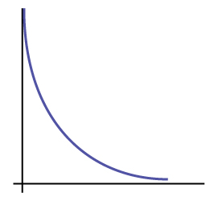

The notation for the **chi-square distribution**{: data-type="term"} is:

<math xmlns="http://www.w3.org/1998/Math/MathML" display="block"> <mrow> <mi>χ</mi><mo>∼</mo><msubsup> <mi>χ</mi> <mrow> <mi>d</mi><mi>f</mi> </mrow> <mn>2</mn> </msubsup> </mrow> </math>

* * *
{: data-type="newline"}

where *df* = degrees of freedom which depends on how chi-square is being used. (If you want to practice calculating chi-square probabilities then use *df* = *n* - 1. The degrees of freedom for the three major uses are each calculated differently.)

For the *χ2* distribution, the population mean is *μ* = *df* and the population standard deviation is <math xmlns="http://www.w3.org/1998/Math/MathML"> <mrow> <mi>σ</mi><mo>=</mo><msqrt> <mrow> <mn>2</mn><mo stretchy="false">(</mo><mi>d</mi><mi>f</mi><mo stretchy="false">)</mo> </mrow> </msqrt> </mrow> </math>

.

The random variable is shown as *χ2*, but may be any upper case letter.

The random variable for a chi-square distribution with *k* degrees of freedom is the sum of *k* independent, squared standard normal variables.

*χ*2 = (*Z*1)2 + (*Z*2)2 + ... + (*Z*k)2

1.  The curve is nonsymmetrical and skewed to the right.
2.  There is a different chi-square curve for each *df*. {: #chisq_curvedf data-media-type="image/png" data-print-width="3in"}

3.  The test statistic for any test is always greater than or equal to zero.
4.  When *df* &gt; 90, the chi-square curve approximates the normal distribution. For *X* ~
    <math xmlns="http://www.w3.org/1998/Math/MathML"> <mrow> <msubsup> <mi>χ</mi> <mrow> <mn>1,000</mn> </mrow> <mn>2</mn> </msubsup> </mrow> </math>
    
    the mean, *μ* = *df* = 1,000 and the standard deviation, *σ* =
    <math xmlns="http://www.w3.org/1998/Math/MathML"> <mrow> <msqrt> <mrow> <mn>2</mn><mo stretchy="false">(</mo><mn>1,000</mn><mo stretchy="false">)</mo> </mrow> </msqrt> </mrow> </math>
    
    = 44.7. Therefore, *X* ~ *N*(1,000, 44.7), approximately.
5.  The mean, *μ*, is located just to the right of the peak. {: #chisq_curvedf2 data-media-type="image/png" data-print-width="3in"}

# References

Data from *Parade Magazine*.

“HIV/AIDS Epidemiology Santa Clara County.”Santa Clara County Public Health Department, May 2011.

# Chapter Review   {#eip-648}

The chi-square distribution is a useful tool for assessment in a series of problem categories. These problem categories include primarily (i) whether a data set fits a particular distribution, (ii) whether the distributions of two populations are the same, (iii) whether two events might be independent, and (iv) whether there is a different variability than expected within a population.

An important parameter in a chi-square distribution is the degrees of freedom *df* in a given problem. The random variable in the chi-square distribution is the sum of squares of *df* standard normal variables, which must be independent. The key characteristics of the chi-square distribution also depend directly on the degrees of freedom.

The chi-square distribution curve is skewed to the right, and its shape depends on the degrees of freedom *df*. For *df* &gt; 90, the curve approximates the normal distribution. Test statistics based on the chi-square distribution are always greater than or equal to zero. Such application tests are almost always right-tailed tests.

# Formula Review   {#eip-257}

*χ*2 = (*Z*1)2 + (*Z*2)2 + … (*Zdf*)2 chi-square distribution random variable

*μχ2* = *df* chi-square distribution population mean

<math xmlns="http://www.w3.org/1998/Math/MathML"> <mrow> <msub> <mi>σ</mi> <mrow> <msup> <mi>χ</mi> <mn>2</mn> </msup> </mrow> </msub> <mtext>=</mtext><msqrt> <mrow> <mn>2</mn><mrow><mo>(</mo> <mrow> <mi>d</mi><mi>f</mi> </mrow> <mo>)</mo></mrow> </mrow> </msqrt> </mrow> </math>

 Chi-Square distribution population standard deviation

<section data-depth="1" id="eip-461" class="practice">

If the number of degrees of freedom for a chi-square distribution is 25, what is the population mean and standard deviation?

mean = 25 and standard deviation = 7.0711

If *df* &gt; 90, the distribution is _____________. If *df* = 15, the distribution is ________________.

When does the chi-square curve approximate a normal distribution?

when the number of degrees of freedom is greater than 90

Where is *μ* located on a chi-square curve?

Is it more likely the *df* is 90, 20, or two in the graph?

{: #eip-idm89632480 data-media-type="image/jpeg"}

*df* = 2

</section>

# Homework

*Decide whether the following statements are true or false.*

As the number of degrees of freedom increases, the graph of the chi-square distribution looks more and more symmetrical.

true

The standard deviation of the chi-square distribution is twice the mean.

The mean and the median of the chi-square distribution are the same if *df* = 24.

false

