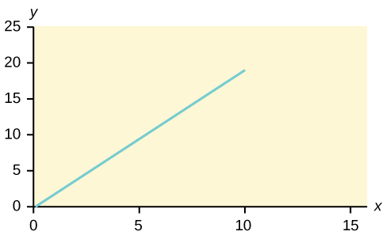
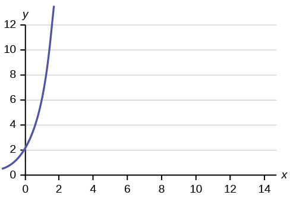

Linear regression for two variables is based on a linear equation with one independent variable. The equation has the form:

<math xmlns="http://www.w3.org/1998/Math/MathML" display="block"> <mi>y</mi> <mo>=</mo> <mi>a</mi> <mo>+</mo> <mtext>bx</mtext> </math>

* * *
{: data-type="newline"}

where *a* and *b* are constant numbers.

The variable ***x* is the independent variable, and *y* is the dependent variable.** Typically, you choose a value to substitute for the independent variable and then solve for the dependent variable.

The following examples are linear equations.

<math xmlns="http://www.w3.org/1998/Math/MathML"><mi>y</mi><mo>=</mo><mn>3</mn><mo>+</mo><mtext>2x</mtext></math>

<math xmlns="http://www.w3.org/1998/Math/MathML"><mi>y</mi><mo>=</mo><mn>–0.01</mn><mo>+</mo><mtext>1.2x</mtext></math>

Try It

Is the following an example of a linear equation?

*y* = –0.125 – 3.5*x*

yes

The graph of a linear equation of the form *y* = *a* + *bx* is a **straight line**. Any line that is not vertical can be described by this equation.

Graph the equation *y* = –1 + 2*x*.

{: #linrgs_lineq1 data-media-type="image/jpeg"}

Try It

Is the following an example of a linear equation? Why or why not?

{: data-media-type="image/png"}

No, the graph is not a straight line; therefore, it is not a linear equation.

Aaron\'s Word Processing Service (AWPS) does word processing. The rate for services is $32 per hour plus a $31.50 one-time charge. The total cost to a customer depends on the number of hours it takes to complete the job.

Find the equation that expresses the **total cost** in terms of the **number of hours** required to complete the job.

Let *x* = the number of hours it takes to get the job done. * * *
{: data-type="newline"}

Let *y* = the total cost to the customer.

The $31.50 is a fixed cost. If it takes *x* hours to complete the job, then (32)(*x*) is the cost of the word processing only. The total cost is: *y* = 31.50 + 32*x*

Try It

Emma’s Extreme Sports hires hang-gliding instructors and pays them a fee of $50 per class as well as $20 per student in the class. The total cost Emma pays depends on the number of students in a class. Find the equation that expresses the total cost in terms of the number of students in a class.

*y* = 50 + 20*x*

# Slope and *Y*-Intercept of a Linear Equation

For the linear equation *y* = *a* + *bx*, *b* = slope and *a* = *y*-intercept. From algebra recall that the slope is a number that describes the steepness of a line, and the *y*-intercept is the *y* coordinate of the point (0, *a*) where the line crosses the *y*-axis.

 If b &gt; 0, the line slopes upward to the right. (b) If b = 0, the line is horizontal. (c) If b &lt; 0, the line slopes downward to the right."){: #linrgs_slope1 data-media-type="image/jpg"}

Svetlana tutors to make extra money for college. For each tutoring session, she charges a one-time fee of $25 plus $15 per hour of tutoring. A linear equation that expresses the total amount of money Svetlana earns for each session she tutors is *y* = 25 + 15*x*.

What are the independent and dependent variables? What is the *y*-intercept and what is the slope? Interpret them using complete sentences.

The independent variable (*x*) is the number of hours Svetlana tutors each session. The dependent variable (*y*) is the amount, in dollars, Svetlana earns for each session.

The *y*-intercept is 25 (*a* = 25). At the start of the tutoring session, Svetlana charges a one-time fee of $25 (this is when *x* = 0). The slope is 15 (*b* = 15). For each session, Svetlana earns $15 for each hour she tutors.

Try It

Ethan repairs household appliances like dishwashers and refrigerators. For each visit, he charges $25 plus $20 per hour of work. A linear equation that expresses the total amount of money Ethan earns per visit is *y* = 25 + 20*x*.

What are the independent and dependent variables? What is the *y*-intercept and what is the slope? Interpret them using complete sentences.

The independent variable (*x*) is the number of hours Ethan works each visit. The dependent variable (*y*) is the amount, in dollars, Ethan earns for each visit.

The *y*-intercept is 25 (*a* = 25). At the start of a visit, Ethan charges a one-time fee of $25 (this is when *x* = 0). The slope is 20 (*b* = 20). For each visit, Ethan earns $20 for each hour he works.

# References   {#eip-746}

Data from the Centers for Disease Control and Prevention.

Data from the National Center for HIV, STD, and TB Prevention.

# Chapter Review   {#eip-645}

The most basic type of association is a linear association. This type of relationship can be defined algebraically by the equations used, numerically with actual or predicted data values, or graphically from a plotted curve. (Lines are classified as straight curves.) Algebraically, a linear equation typically takes the form ***y = mx + b***, where ***m*** and ***b*** are constants, ***x*** is the independent variable, ***y*** is the dependent variable. In a statistical context, a linear equation is written in the form ***y = a + bx***, where ***a*** and ***b*** are the constants. This form is used to help readers distinguish the statistical context from the algebraic context. In the equation *y = a + bx*, the constant *b* that multiplies the ***x*** variable (*b* is called a coefficient) is called as the **slope**. The slope describes the rate of change between the independent and dependent variables; in other words, the rate of change describes the change that occurs in the dependent variable as the independent variable is changed. In the equation *y = a + bx*, the constant a is called as the *y*-intercept. Graphically, the *y*-intercept is the *y* coordinate of the point where the graph of the line crosses the *y* axis. At this point *x* = 0.

The **slope of a line** is a value that describes the rate of change between the independent and dependent variables. The **slope** tells us how the dependent variable (*y*) changes for every one unit increase in the independent (*x*) variable, on average. The ***y*-intercept** is used to describe the dependent variable when the independent variable equals zero. Graphically, the slope is represented by three line types in elementary statistics.

# Formula Review   {#eip-190}

*y* = *a* + *bx* where *a* is the *y*-intercept and *b* is the slope. The variable *x* is the independent variable and *y* is the dependent variable.

<section data-depth="1" id="eip-178" class="practice" markdown="1">
*Use the following information to answer the next three exercises*. A vacation resort rents SCUBA equipment to certified divers. The resort charges an up-front fee of $25 and another fee of $12.50 an hour.

What are the dependent and independent variables?

dependent variable: fee amount; independent variable: time

Find the equation that expresses the total fee in terms of the number of hours the equipment is rented.

Graph the equation from [[link]](#eip-683).

{: data-media-type="image/jpeg"}

* * *
{: data-type="newline"}

*Use the following information to answer the next two exercises*. A credit card company charges $10 when a payment is late, and $5 a day each day the payment remains unpaid.

Find the equation that expresses the total fee in terms of the number of days the payment is late.

Graph the equation from [[link]](#eip-23).

{: data-media-type="image/jpeg"}

Is the equation *y* = 10 + 5*x* – 3*x*2 linear? Why or why not?

Which of the following equations are linear?

a. *y* = 6*x* + 8

b. *y* + 7 = 3*x*

c. *y* – *x* = 8*x*2

d. 4*y* = 8

*y* = 6*x* + 8, 4*y* = 8, and *y* + 7 = 3*x* are all linear equations.

Does the graph show a linear equation? Why or why not?

{: data-media-type="image/jpeg"}

[\[link\]](#element-806) contains real data for the first two decades of AIDS reporting.

<table id="element-806" summary="This table presents the year of reporting AIDS cases and deaths in the first column, number of AIDS cases diagnosed in the second column, and number of AIDS deaths in the third column."><caption>Adults and Adolescents only, United States </caption><tbody>
          <tr>
            <td>
              <strong>Year </strong>
            </td>
            <td>
              <strong># AIDS cases diagnosed</strong>
            </td>
            <td>
              <strong># AIDS deaths </strong>
            </td>
          </tr>
          <tr>
            <td>Pre-1981</td>
            <td>91</td>
            <td>29</td>
          </tr>
          <tr>
            <td>1981</td>
            <td>319</td>
            <td>121</td>
          </tr>
          <tr>
            <td>1982</td>
            <td>1,170</td>
            <td>453</td>
          </tr>
          <tr>
            <td>1983</td>
            <td>3,076</td>
            <td>1,482</td>
          </tr>
          <tr>
            <td>1984</td>
            <td>6,240</td>
            <td>3,466</td>
          </tr>
          <tr>
            <td>1985</td>
            <td>11,776</td>
            <td>6,878</td>
          </tr>
          <tr>
            <td>1986</td>
            <td>19,032</td>
            <td>11,987</td>
          </tr>
          <tr>
            <td>1987</td>
            <td>28,564</td>
            <td>16,162</td>
          </tr>
          <tr>
            <td>1988</td>
            <td>35,447</td>
            <td>20,868</td>
          </tr>
          <tr>
            <td>1989</td>
            <td>42,674</td>
            <td>27,591</td>
          </tr>
          <tr>
            <td>1990</td>
            <td>48,634</td>
            <td>31,335</td>
          </tr>
          <tr>
            <td>1991</td>
            <td>59,660</td>
            <td>36,560</td>
          </tr>
          <tr>
            <td>1992</td>
            <td>78,530</td>
            <td>41,055</td>
          </tr>
          <tr>
            <td>1993</td>
            <td>78,834</td>
            <td>44,730</td>
          </tr>
          <tr>
            <td>1994</td>
            <td>71,874</td>
            <td>49,095</td>
          </tr>
          <tr>
            <td>1995</td>
            <td>68,505</td>
            <td>49,456</td>
          </tr>
          <tr>
            <td>1996</td>
            <td>59,347</td>
            <td>38,510</td>
          </tr>
          <tr>
            <td>1997</td>
            <td>47,149</td>
            <td>20,736</td>
          </tr>
          <tr>
            <td>1998</td>
            <td>38,393</td>
            <td>19,005</td>
          </tr>
          <tr>
            <td>1999</td>
            <td>25,174</td>
            <td>18,454</td>
          </tr>
          <tr>
            <td>2000</td>
            <td>25,522</td>
            <td>17,347</td>
          </tr>
          <tr>
            <td>2001</td>
            <td>25,643</td>
            <td>17,402</td>
          </tr>
          <tr>
            <td>2002</td>
            <td>26,464</td>
            <td>16,371</td>
          </tr>
          <tr>
            <td>
              <strong>Total</strong>
            </td>
            <td>
              <strong>802,118</strong>
            </td>
            <td>
              <strong>489,093</strong>
            </td>
          </tr>
        </tbody></table>

Use the columns "year" and "# AIDS cases diagnosed. Why is “year” the independent variable and “# AIDS cases diagnosed.” the dependent variable (instead of the reverse)?

The number of AIDS cases depends on the year. Therefore, year becomes the independent variable and the number of AIDS cases is the dependent variable.

* * *
{: data-type="newline"}

*Use the following information to answer the next two exercises*. A specialty cleaning company charges an equipment fee and an hourly labor fee. A linear equation that expresses the total amount of the fee the company charges for each session is *y* = 50 + 100*x*.

What are the independent and dependent variables?

What is the *y*-intercept and what is the slope? Interpret them using complete sentences.

The *y*-intercept is 50 (*a* = 50). At the start of the cleaning, the company charges a one-time fee of $50 (this is when *x* = 0). The slope is 100 (*b* = 100). For each session, the company charges $100 for each hour they clean.

* * *
{: data-type="newline"}

*Use the following information to answer the next three questions*. Due to erosion, a river shoreline is losing several thousand pounds of soil each year. A linear equation that expresses the total amount of soil lost per year is *y* = 12,000*x*.

What are the independent and dependent variables?

How many pounds of soil does the shoreline lose in a year?

12,000 pounds of soil

What is the *y*-intercept? Interpret its meaning.

* * *
{: data-type="newline"}

*Use the following information to answer the next two exercises*. The price of a single issue of stock can fluctuate throughout the day. A linear equation that represents the price of stock for Shipment Express is *y* = 15 – 1.5*x* where *x* is the number of hours passed in an eight-hour day of trading.

What are the slope and *y*-intercept? Interpret their meaning.

The slope is –1.5 (*b* = –1.5). This means the stock is losing value at a rate of $1.50 per hour. The *y*-intercept is $15 (*a* = 15). This means the price of stock before the trading day was $15.

If you owned this stock, would you want a positive or negative slope? Why?

</section>

# Homework

For each of the following situations, state the independent variable and the dependent variable.

1.  A study is done to determine if elderly drivers are involved in more motor vehicle fatalities than other drivers. The number of fatalities per 100,000 drivers is compared to the age of drivers.
2.  A study is done to determine if the weekly grocery bill changes based on the number of family members.
3.  Insurance companies base life insurance premiums partially on the age of the applicant.
4.  Utility bills vary according to power consumption.
5.  A study is done to determine if a higher education reduces the crime rate in a population.
{: data-number-style="lower-alpha"}

1.  independent variable: age; dependent variable: fatalities
2.  independent variable: # of family members; dependent variable: grocery bill
3.  independent variable: age of applicant; dependent variable: insurance premium
4.  independent variable: power consumption; dependent variable: utility
5.  independent variable: higher education (years); dependent variable: crime rates
{: data-number-style="lower-alpha"}

Piece-rate systems are widely debated incentive payment plans. In a recent study of loan officer effectiveness, the following piece-rate system was examined:

<table summary=".."><caption></caption><tbody>
<tr>
<td>% of goal reached</td>
<td>&lt; 80</td>
<td>80</td>
<td>100</td>
<td>120</td>
</tr>
<tr>
<td>Incentive</td>
<td>n/a</td>
<td>$4,000 with an additional $125 added per percentage point from 81–99%</td>
<td>$6,500 with an additional $125 added per percentage point from 101–119%</td>
<td>$9,500 with an additional $125 added per percentage point starting at 121%</td>
</tr>
</tbody></table>
If a loan officer makes 95% of his or her goal, write the linear function that applies based on the incentive plan table. In context, explain the *y*-intercept and slope.

