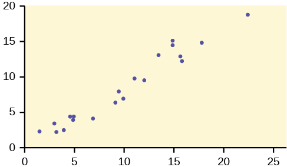
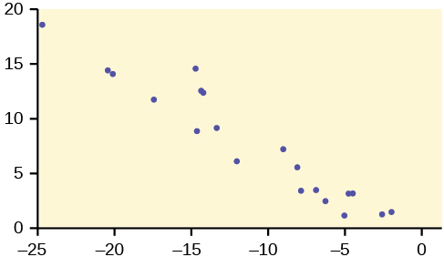
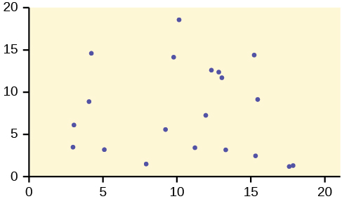
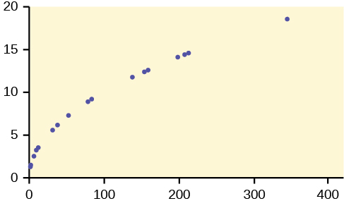
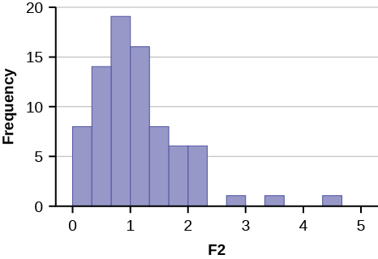

# 12.1 Linear Equations

Which of the following equations is/are linear?

1.  *y* = –3*x*
2.  *y* = 0.2 + 0.74*x*
3.  *y* = –9.4 – 2*x*
4.  A and B
5.  A, B, and C
{: data-number-style="lower-alpha"}

To complete a painting job requires four hours setup time plus one hour per 1,000 square feet. How would you express this information in a linear equation?

A statistics instructor is paid a per-class fee of $2,000 plus $100 for each student in the class. How would you express this information in a linear equation?

A tutoring school requires students to pay a one-time enrollment fee of $500 plus tuition of $3,000 per year. Express this information in an equation.

# 12.2: Slope and *Y*-intercept of a Linear Equation

*Use the following information to answer the next four exercises.* For the labor costs of doing repairs, an auto mechanic charges a flat fee of $75 per car, plus an hourly rate of $55.

What are the independent and dependent variables for this situation?

Write the equation and identify the slope and intercept.

What is the labor charge for a job that takes 3.5 hours to complete?

One job takes 2.4 hours to complete, while another takes 6.3 hours. What is the difference in labor costs for these two jobs?

# 12.3: Scatter Plots

Describe the pattern in this scatter plot, and decide whether the *X* and *Y* variables would be good candidates for linear regression.

{: data-media-type="image/jpeg"}

Describe the pattern in this scatter plot, and decide whether the *X* and *Y* variables would be good candidates for linear regression.

{: data-media-type="image/jpeg"}

Describe the pattern in this scatter plot, and decide whether the *X* and *Y* variables would be good candidates for linear regression.

{: data-media-type="image/jpeg"}

Describe the pattern in this scatter plot, and decide whether the *X* and *Y* variables would be good candidates for linear regression.

{: data-media-type="image/jpeg"}

# 12.4: The Regression Equation

*Use the following information to answer the next four exercises.* Height (in inches) and weight (In pounds) in a sample of college freshman men have a linear relationship with the following summary statistics: * * *
{: data-type="newline"}

<math xmlns="http://www.w3.org/1998/Math/MathML"> <mover accent="true"> <mi>x</mi> <mo>¯</mo> </mover> </math>

 = 68.4 * * *
{: data-type="newline"}

<math xmlns="http://www.w3.org/1998/Math/MathML"> <mover accent="true"> <mi>y</mi> <mo>¯</mo> </mover> </math>

 =141.6 * * *
{: data-type="newline"}

*sx* = 4.0 * * *
{: data-type="newline"}

*sy* = 9.6 * * *
{: data-type="newline"}

*r* = 0.73 * * *
{: data-type="newline"}

Let *Y* = weight and *X* = height, and write the regression equation in the form: * * *
{: data-type="newline"}

<math xmlns="http://www.w3.org/1998/Math/MathML"> <mrow> <mover accent="true"> <mi>y</mi> <mo>^</mo> </mover> <mo>=</mo><mi>a</mi><mo>+</mo><mi>b</mi><mi>x</mi> </mrow> </math>

What is the value of the slope?

What is the value of the *y* intercept?

Write the regression equation predicting weight from height in this data set, and calculate the predicted weight for someone 68 inches tall.

# 12.5: Correlation Coefficient and Coefficient of Determination

The correlation between body weight and fuel efficiency (measured as miles per gallon) for a sample of 2,012 model cars is –0.56. Calculate the coefficient of determination for this data and explain what it means.

The correlation between high school GPA and freshman college GPA for a sample of 200 university students is 0.32. How much variation in freshman college GPA is not explained by high school GPA?

Rounded to two decimal places what correlation between two variables is necessary to have a coefficient of determination of at least 0.50?

# 12.6: Testing the Significance of the Correlation Coefficient

Write the null and alternative hypotheses for a study to determine if two variables are significantly correlated.

In a sample of 30 cases, two variables have a correlation of 0.33. Do a *t*-test to see if this result is significant at the *α* = 0.05 level. Use the formula: * * *
{: data-type="newline"}

<math xmlns="http://www.w3.org/1998/Math/MathML"> <mrow> <mi>t</mi><mo>=</mo><mfrac> <mrow> <mi>r</mi><msqrt> <mrow> <mi>n</mi><mo>−</mo><mn>2</mn> </mrow> </msqrt> </mrow> <mrow> <msqrt> <mrow> <mn>1</mn><mo>−</mo><msup> <mi>r</mi> <mn>2</mn> </msup> </mrow> </msqrt> </mrow> </mfrac> </mrow> </math>

In a sample of 25 cases, two variables have a correlation of 0.45. Do a *t*-test to see if this result is significant at the *α* = 0.05 level. Use the formula: * * *
{: data-type="newline"}

<math xmlns="http://www.w3.org/1998/Math/MathML"> <mrow> <mi>t</mi><mo>=</mo><mfrac> <mrow> <mi>r</mi><msqrt> <mrow> <mi>n</mi><mo>−</mo><mn>2</mn> </mrow> </msqrt> </mrow> <mrow> <msqrt> <mrow> <mn>1</mn><mo>−</mo><msup> <mi>r</mi> <mn>2</mn> </msup> </mrow> </msqrt> </mrow> </mfrac> </mrow> </math>

# 12.7: Prediction

*Use the following information to answer the next two exercises.* A study relating the grams of potassium (*Y*) to the grams of fiber (*X*) per serving in enriched flour products (bread, rolls, etc.) produced the equation: * * *
{: data-type="newline"}

<math xmlns="http://www.w3.org/1998/Math/MathML"> <mrow> <mover accent="true"> <mi>y</mi> <mo>^</mo> </mover> <mo>=</mo><mn>25</mn><mo>+</mo><mn>16</mn><mi>x</mi> </mrow> </math>

For a product with five grams of fiber per serving, what are the expected grams of potassium per serving?

Comparing two products, one with three grams of fiber per serving and one with six grams of fiber per serving, what is the expected difference in grams of potassium per serving?

# 12.8: Outliers

In the context of regression analysis, what is the definition of an outlier, and what is a rule of thumb to evaluate if a given value in a data set is an outlier?

In the context of regression analysis, what is the definition of an influential point, and how does an influential point differ from an outlier?

The least squares regression line for a data set is <math xmlns="http://www.w3.org/1998/Math/MathML"> <mrow> <mover accent="true"> <mi>y</mi> <mo>^</mo> </mover> <mo>=</mo><mn>5</mn><mo>+</mo><mn>0.3</mn><mi>x</mi> </mrow> </math>

 and the standard deviation of the residuals is 0.4. Does a case with the values *x* = 2, *y* = 6.2 qualify as an outlier?

The least squares regression line for a data set is <math xmlns="http://www.w3.org/1998/Math/MathML"> <mrow> <mover accent="true"> <mi>y</mi> <mo>^</mo> </mover> <mo>=</mo><mn>2.3</mn><mo>−</mo><mn>0.1</mn><mi>x</mi> </mrow> </math>

 and the standard deviation of the residuals is 0.13. Does a case with the values *x* = 4.1, *y* = 2.34 qualify as an outlier?

# 13.1: One-Way ANOVA

What are the five basic assumptions to be met if you want to do a one-way ANOVA?

You are conducting a one-way ANOVA comparing the effectiveness of four drugs in lowering blood pressure in hypertensive patients. What are the null and alternative hypotheses for this study?

What is the primary difference between the independent samples *t*-test and one-way ANOVA?

You are comparing the results of three methods of teaching geometry to high school students. The final exam scores *X*1, *X*2, *X*3, for the samples taught by the different methods have the following distributions: * * *
{: data-type="newline"}

*X*1 ~ *N*(85, 3.6) * * *
{: data-type="newline"}

*X*1 ~ *N*(82, 4.8) * * *
{: data-type="newline"}

*X*1 ~ *N*(79, 2.9) * * *
{: data-type="newline"}

Each sample includes 100 students, and the final exam scores have a range of 0–100. Assuming the samples are independent and randomly selected, have the requirements for conducting a one-way ANOVA been met? Explain why or why not for each assumption.

You conduct a study comparing the effectiveness of four types of fertilizer to increase crop yield on wheat farms. When examining the sample results, you find that two of the samples have an approximately normal distribution, and two have an approximately uniform distribution. Is this a violation of the assumptions for conducting a one-way ANOVA?

# 13.2: The *F* Distribution

*Use the following information to answer the next seven exercises.* You are conducting a study of three types of feed supplements for cattle to test their effectiveness in producing weight gain among calves whose feed includes one of the supplements. You have four groups of 30 calves (one is a control group receiving the usual feed, but no supplement). You will conduct a one-way ANOVA after one year to see if there are difference in the mean weight for the four groups.

What is *SSwithin* in this experiment, and what does it mean?

What is *SSbetween* in this experiment, and what does it mean?

What are *k* and *i* for this experiment?

If *SSwithin* = 374.5 and *SStotal* = 621.4 for this data, what is *SSbetween*?

What are *MSbetween*, and *MSwithin*, for this experiment?

What is the *F* Statistic for this data?

If there had been 35 calves in each group, instead of 30, with the sums of squares remaining the same, would the *F* Statistic be larger or smaller?

# 13.3: Facts About the *F* Distribution

Which of the following numbers are possible *F* Statistics?

1.  2\.47
2.  5\.95
3.  –3.61
4.  7\.28
5.  0\.97
{: data-number-style="lower-alpha"}

Histograms *F*1 and *F*2 below display the distribution of cases from samples from two populations, one distributed *F*3,15 and one distributed *F*5,500. Which sample came from which population?

{: data-media-type="image/jpeg"}

{: data-media-type="image/jpeg"}

The *F* Statistic from an experiment with *k* = 3 and *n* = 50 is 3.67. At *α* = 0.05, will you reject the null hypothesis?

The *F* Statistic from an experiment with *k* = 4 and *n* = 100 is 4.72. At *α* = 0.01, will you reject the null hypothesis?

# 13.4: Test of Two Variances

What assumptions must be met to perform the *F* test of two variances?

You believe there is greater variance in grades given by the math department at your university than in the English department. You collect all the grades for undergraduate classes in the two departments for a semester, and compute the variance of each, and conduct an *F* test of two variances. What are the null and alternative hypotheses for this study?

