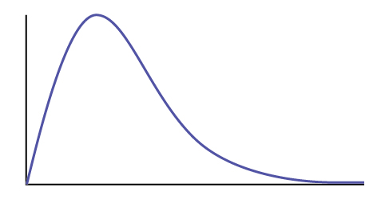

Class Time: \\\_\\\_\\\_\\\_\\\_\\\_\\\_\\\_\\\_\\\_\\\_\\\_\\\_\\\_\\\_\\\_\\\_\\\_\\\_\\\_\\\_\\\_\\\_\\\_\\\_\\\_* * *
{: data-type="newline"}

 Name: \\\_\\\_\\\_\\\_\\\_\\\_\\\_\\\_\\\_\\\_\\\_\\\_\\\_\\\_\\\_\\\_\\\_\\\_\\\_\\\_\\\_\\\_\\\_\\\_\\\_\\\_\\\_\\\_\\\_\\\_\\\_\\\_\\\_\\\_\\\_\\\_

1.  *H0*\: \\\_\\\_\\\_\\\_\\\_\\\_\\\_
2.  *Ha*\: \\\_\\\_\\\_\\\_\\\_\\\_\\\_
3.  What are the degrees of freedom?
4.  State the distribution to use for the test.
5.  What is the test statistic?
6.  What is the *p*-value? In one to two complete sentences, explain what the *p*-value means for this problem.
7.  Use the previous information to sketch a picture of this situation. **Clearly** label and scale the horizontal axis and shade the region(s) corresponding to the *p*-value. {: #id10146455 data-media-type="image/png"}

8.  Indicate the correct decision (“reject” or “do not reject” the null hypothesis) and write appropriate conclusions, using <strong>complete sentences. </strong>
    1.  Alpha: \\\_\\\_\\\_\\\_\\\_\\\_\\\_
    2.  Decision: \\\_\\\_\\\_\\\_\\\_\\\_\\\_
    3.  Reason for decision: \\\_\\\_\\\_\\\_\\\_\\\_\\\_
    4.  Conclusion: \\\_\\\_\\\_\\\_\\\_\\\_\\\_
    {: data-number-style="lower-roman"}
{: data-number-style="lower-alpha"}

