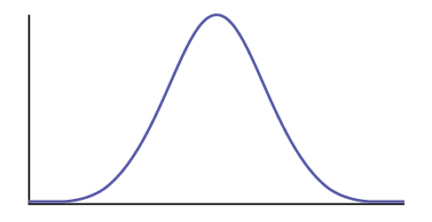

Class Time: \_\_\_\_\_\_\_\_\_\_\_\_\_\_\_\_\_\_\_\_\_\_\_\_\_\_* * *
{: data-type="newline"}

 Name: \_\_\_\_\_\_\_\_\_\_\_\_\_\_\_\_\_\_\_\_\_\_\_\_\_\_\_\_\_\_\_\_\_\_\_\_\_

1.  *H0*\: \_\_\_\_\_\_\_
2.  *Ha*\: \_\_\_\_\_\_\_
3.  In words, **clearly** state what your random variable
    <math xmlns="http://www.w3.org/1998/Math/MathML"> <mrow> <msub> <mover accent="true"> <mi>X</mi> <mo>¯</mo> </mover> <mn>1</mn> </msub> <mo>−</mo><msub> <mover accent="true"> <mi>X</mi> <mo>¯</mo> </mover> <mn>2</mn> </msub> </mrow> </math>
    
    ,
    <math xmlns="http://www.w3.org/1998/Math/MathML"> <mrow> <msub> <msup> <mi>P</mi> <mo>′</mo> </msup> <mn>1</mn> </msub> <mo>−</mo><msub> <msup> <mi>P</mi> <mo>′</mo> </msup> <mn>2</mn> </msub> </mrow> </math>
    
    or
    <math xmlns="http://www.w3.org/1998/Math/MathML"> <mrow> <msub> <mover accent="true"> <mi>X</mi> <mo>¯</mo> </mover> <mi>d</mi> </msub> </mrow> </math>
    
    represents.
4.  State the distribution to use for the test.
5.  What is the test statistic?
6.  What is the *p*-value? In one to two complete sentences, explain what the p-value means for this problem.
7.  Use the previous information to sketch a picture of this situation. **CLEARLY** label and scale the horizontal axis and shade the region(s) corresponding to the *p*-value. {: #id13017561 data-media-type="image/png"}

8.  Indicate the correct decision (“reject” or “do not reject” the null hypothesis), the reason for it, and write an appropriate conclusion, using **complete sentences**.
    1.  Alpha: \_\_\_\_\_\_\_
    2.  Decision: \_\_\_\_\_\_\_
    3.  Reason for decision: \_\_\_\_\_\_\_
    4.  Conclusion: \_\_\_\_\_\_\_
    {: data-number-style="lower-alpha"}

9.  In complete sentences, explain how you determined which distribution to use.
{: data-number-style="lower-alpha"}

