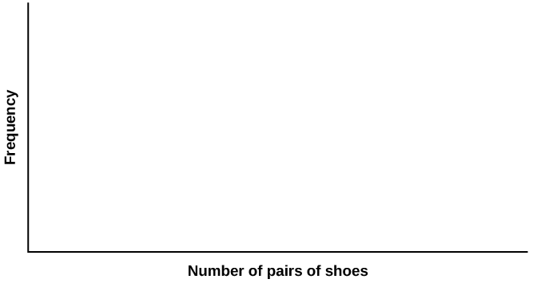

Descriptive Statistics

Class Time:

Names:

Student Learning Outcomes

* The student will construct a histogram and a box plot.
* The student will calculate univariate statistics.
* The student will examine the graphs to interpret what the data implies.

Collect the Data Record the number of pairs of shoes you own.

1.  Randomly survey 30 classmates about the number of pairs of shoes they own. Record their values.
    <table id="element-30" summary="This is a blank table with 30 cells for recording values."><caption>Survey Results</caption><tbody>
    <tr>
    <td>\_\_\_\_\_</td>
    <td>\_\_\_\_\_</td>
    <td>\_\_\_\_\_</td>
    <td>\_\_\_\_\_</td>
    <td>\_\_\_\_\_</td>
    </tr>
    <tr>
    <td>\_\_\_\_\_</td>
    <td>\_\_\_\_\_</td>
    <td>\_\_\_\_\_</td>
    <td>\_\_\_\_\_</td>
    <td>\_\_\_\_\_</td>
    </tr>
    <tr>
    <td>\_\_\_\_\_</td>
    <td>\_\_\_\_\_</td>
    <td>\_\_\_\_\_</td>
    <td>\_\_\_\_\_</td>
    <td>\_\_\_\_\_</td>
    </tr>
    <tr>
    <td>\_\_\_\_\_</td>
    <td>\_\_\_\_\_</td>
    <td>\_\_\_\_\_</td>
    <td>\_\_\_\_\_</td>
    <td>\_\_\_\_\_</td>
    </tr>
    <tr>
    <td>\_\_\_\_\_</td>
    <td>\_\_\_\_\_</td>
    <td>\_\_\_\_\_</td>
    <td>\_\_\_\_\_</td>
    <td>\_\_\_\_\_</td>
    </tr>
    <tr>
    <td>\_\_\_\_\_</td>
    <td>\_\_\_\_\_</td>
    <td>\_\_\_\_\_</td>
    <td>\_\_\_\_\_</td>
    <td>\_\_\_\_\_</td>
    </tr>
    </tbody></table>

2.  Construct a histogram. Make five to six intervals. Sketch the graph using a ruler and pencil and scale the axes. {: #element-2356 data-media-type="image/png"}

3.  Calculate the following values.
    1.  <math xmlns="http://www.w3.org/1998/Math/MathML"> <mover accent="true"> <mi>x</mi> <mo>¯</mo> </mover> </math>
        
        = \\\_\\\_\\\_\\\_\\\_
    2.  *s* = \\\_\\\_\\\_\\\_\\\_
    {: data-number-style="lower-alpha"}

4.  Are the data discrete or continuous? How do you know?
5.  In complete sentences, describe the shape of the histogram.
6.  Are there any potential outliers? List the value(s) that could be outliers. Use a formula to check the end values to determine if they are potential outliers.

Analyze the Data

1.  Determine the following values.
    1.  Min = \\\_\\\_\\\_\\\_\\\_
    2.  *M* = \\\_\\\_\\\_\\\_\\\_
    3.  Max = \\\_\\\_\\\_\\\_\\\_
    4.  *Q*1 = \\\_\\\_\\\_\\\_\\\_
    5.  *Q*3 = \\\_\\\_\\\_\\\_\\\_
    6.  *IQR* = \\\_\\\_\\\_\\\_\\\_
    {: data-number-style="lower-alpha"}

2.  Construct a box plot of data
3.  What does the shape of the box plot imply about the concentration of data? Use complete sentences.
4.  Using the box plot, how can you determine if there are potential outliers?
5.  How does the standard deviation help you to determine concentration of the data and whether or not there are potential outliers?
6.  What does the *IQR* represent in this problem?
7.  Show your work to find the value that is 1.5 standard deviations:
    1.  above the mean.
    2.  below the mean.
    {: data-number-style="lower-alpha"}

